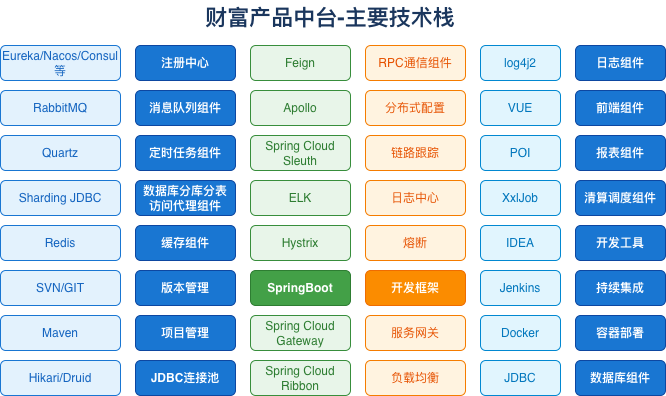

# 财富中台技术组件解析

> 基于 Spring Cloud 的企业级技术栈

## 技术组件图

---

## 📊 技术栈概览

财富中台采用成熟的 Spring Cloud 技术栈，涵盖微服务治理、数据处理、开发运维等全方位能力。

---

## 🔧 核心组件分类

### 1. 微服务治理

| 功能         | 技术选型             | 说明                         |
| ------------ | -------------------- | ---------------------------- |
| **注册中心** | Eureka/Nacos/Consul  | 服务注册与发现，支持多种实现 |
| **配置中心** | Apollo               | 分布式配置管理，支持热更新   |
| **服务网关** | Spring Cloud Gateway | API 网关，路由、限流、鉴权   |
| **负载均衡** | Spring Cloud Ribbon  | 客户端负载均衡               |
| **熔断降级** | Hystrix              | 服务降级保护，防止雪崩       |
| **RPC通信**  | Feign                | 声明式 HTTP 客户端           |
| **链路追踪** | Spring Cloud Sleuth  | 分布式链路追踪               |

---

### 2. 数据层

| 功能           | 技术选型      | 说明               |
| -------------- | ------------- | ------------------ |
| **连接池**     | Hikari/Druid  | 高性能数据库连接池 |
| **分库分表**   | Sharding JDBC | 数据库水平拆分     |
| **缓存**       | Redis         | 分布式缓存         |
| **消息队列**   | RabbitMQ      | 异步消息处理       |
| **数据库访问** | JDBC          | 标准数据库连接     |

---

### 3. 开发框架

| 功能         | 技术选型   | 说明             |
| ------------ | ---------- | ---------------- |
| **核心框架** | SpringBoot | 微服务开发基础   |
| **前端框架** | VUE        | 现代化前端开发   |
| **日志组件** | log4j2     | 高性能日志框架   |
| **报表组件** | POI        | Excel 处理       |
| **定时任务** | Quartz     | 任务调度管理     |
| **清算调度** | 自研       | 核心业务自主可控 |

---

### 4. 运维监控

| 功能         | 技术选型 | 说明                 |
| ------------ | -------- | -------------------- |
| **日志中心** | ELK      | 日志采集、存储、分析 |
| **开发工具** | IDEA     | JetBrains IDE        |
| **版本管理** | SVN/GIT  | 代码版本控制         |
| **项目管理** | Maven    | 依赖管理和构建       |
| **持续集成** | Jenkins  | CI/CD 自动化         |
| **容器部署** | Docker   | 容器化部署           |

---

## 💡 灵活性说明

> 其中注册中心、服务网关、配置中心、日志中心、监控中心等服务也可以根据需要替换或者统一对接行里的各类组件

**可替换组件：**

- 注册中心：可替换为行内统一注册中心
- 服务网关：可对接行内 API 网关
- 配置中心：可对接行内配置管理平台
- 日志中心：可对接行内日志平台
- 监控中心：可对接行内监控系统

---

## 🎯 技术选型原则

1. **成熟稳定**：选用经过验证的主流框架
2. **生态丰富**：Spring Cloud 生态，社区活跃
3. **可替换性**：核心组件可按需替换
4. **自主可控**：核心业务逻辑自研
