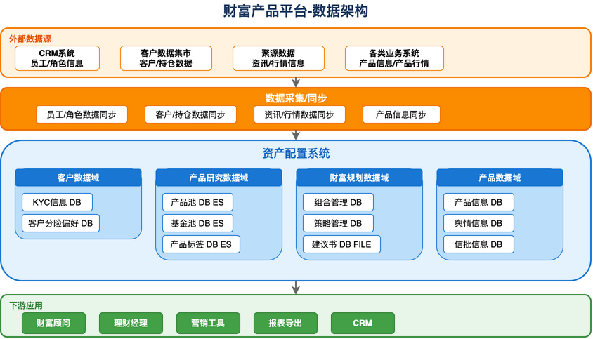

# 财富产品平台数据架构解析

> 基于数据域划分的企业级数据架构

## 数据架构图

---

## 📊 架构概述

财富产品平台采用**分层式数据架构**，实现从外部数据源到业务应用的完整数据链路。

---

## 🔄 数据流转层次

### 1. 外部数据源

| 数据源           | 数据内容          | 说明         |
| ---------------- | ----------------- | ------------ |
| **CRM系统**      | 员工/角色信息     | 人员组织数据 |
| **客户数据集市** | 客户/持仓数据     | 客户基础数据 |
| **聚源数据**     | 资讯/行情信息     | 市场行情数据 |
| **各类业务系统** | 产品信息/产品行情 | 产品相关数据 |

---

### 2. 数据采集/同步

统一的数据采集层，负责各类数据的同步：

- 员工/角色数据同步
- 客户/持仓数据同步
- 资讯/行情数据同步
- 产品信息同步

---

### 3. 资产配置系统核心数据域

#### 客户数据域

| 数据表       | 存储类型 | 说明             |
| ------------ | -------- | ---------------- |
| KYC信息      | DB       | 客户身份认证信息 |
| 客户分险偏好 | DB       | 客户风险评估结果 |

#### 产品研究数据域

| 数据表   | 存储类型 | 说明         |
| -------- | -------- | ------------ |
| 产品池   | DB + ES  | 产品筛选池   |
| 基金池   | DB + ES  | 基金筛选池   |
| 产品标签 | DB + ES  | 产品分类标签 |

#### 财富规划数据域

| 数据表   | 存储类型  | 说明           |
| -------- | --------- | -------------- |
| 组合管理 | DB        | 投资组合配置   |
| 策略管理 | DB        | 投资策略定义   |
| 建议书   | DB + FILE | 财富规划建议书 |

#### 产品数据域

| 数据表   | 存储类型 | 说明         |
| -------- | -------- | ------------ |
| 产品信息 | DB       | 产品基础信息 |
| 舆情信息 | DB       | 市场舆情数据 |
| 信批信息 | DB       | 信息披露数据 |

---

### 4. 下游应用

数据服务的消费方：

| 应用         | 用途         |
| ------------ | ------------ |
| **财富顾问** | 客户财富管理 |
| **理财经理** | 理财产品销售 |
| **营销工具** | 精准营销支持 |
| **报表导出** | 数据报表生成 |
| **CRM**      | 客户关系管理 |

---

## 💡 存储技术选型

| 类型     | 技术          | 适用场景           |
| -------- | ------------- | ------------------ |
| **DB**   | 关系型数据库  | 结构化数据存储     |
| **ES**   | Elasticsearch | 全文检索、标签查询 |
| **FILE** | 文件存储      | 文档、建议书等     |
