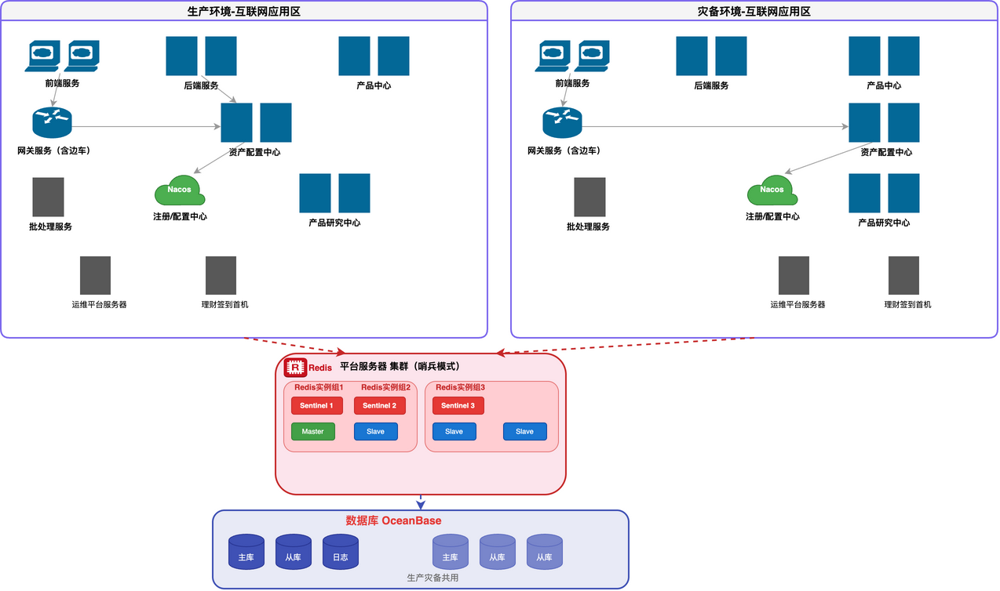

# 财富产品平台部署架构解析

> 生产+灾备双活部署方案

## 部署架构图

---

## 📊 架构概述

财富产品平台采用**生产+灾备双机房**部署方案，关键中间件和数据库实现跨机房共享，确保业务高可用。

---

## 🏢 生产环境 - 互联网应用区

| 服务组件               | 部署方式  | 说明                           |
| ---------------------- | --------- | ------------------------------ |
| **前端服务**           | 2节点集群 | 承载 Web 前端页面              |
| **后端服务**           | 2节点集群 | 核心业务后端                   |
| **产品中心**           | 2节点集群 | 产品管理服务                   |
| **网关服务（含边车）** | 单节点    | Spring Cloud Gateway + Sidecar |
| **资产配置中心**       | 2节点集群 | 资产配置核心服务               |
| **注册/配置中心**      | 单节点    | Nacos/Eureka 注册与配置        |
| **批处理服务**         | 单节点    | 定时/批量任务处理              |
| **产品研究中心**       | 2节点集群 | 产品研究分析                   |
| **运维平台服务器**     | 单节点    | 运维监控管理                   |
| **理财签到首机**       | 单节点    | 理财签到入口                   |

---

## 🔄 灾备环境 - 互联网应用区

灾备环境与生产环境采用**镜像部署**，包含相同的服务组件，确保在生产环境故障时快速接管。

| 特点     | 说明                      |
| -------- | ------------------------- |
| 部署结构 | 与生产一致，服务全量部署  |
| 切换方式 | DNS/负载切换              |
| 数据同步 | 通过 OceanBase 多副本同步 |

---

## 🗄️ 共享基础设施（生产灾备共用）

### Redis 集群（哨兵模式）

| 组件         | 数量  | 说明                             |
| ------------ | ----- | -------------------------------- |
| **Sentinel** | 3节点 | 哨兵节点，负责故障检测和主从切换 |
| **Master**   | 1节点 | 主节点，处理读写请求             |
| **Slave**    | 3节点 | 从节点，同步主节点数据           |

**哨兵模式优势：**

- 自动故障转移
- 主从自动切换
- 高可用保障

---

### OceanBase 数据库

| 部署组件        | 说明              |
| --------------- | ----------------- |
| **生产主库**    | 承载生产读写      |
| **生产从库**    | 读扩展 + 数据备份 |
| **日志库**      | 操作日志记录      |
| **灾备主库**    | 灾备读写          |
| **灾备从库 ×2** | 灾备读扩展        |

**特点：** 生产灾备共用 OceanBase 分布式数据库，利用多副本机制实现跨机房数据同步。

---

## 💡 部署策略

1. **双活架构**：生产和灾备同时运行，灾备可随时接管
2. **中间件共享**：Redis 和 OceanBase 跨机房部署，数据一致
3. **弹性扩展**：各服务节点可按需水平扩展
4. **边车模式**：网关集成边车，支持服务网格能力
