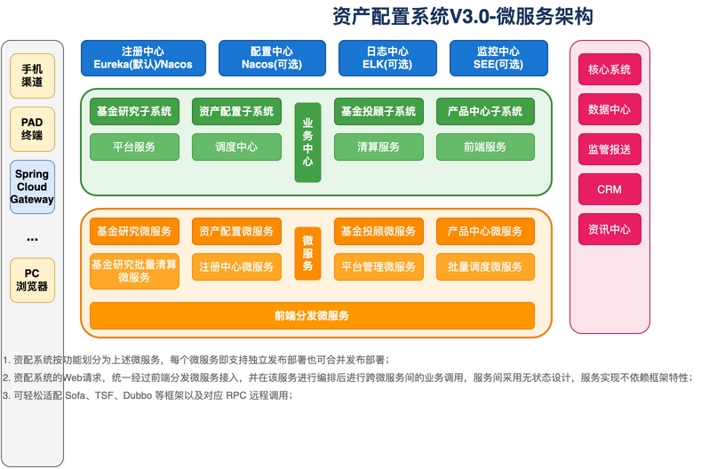

# 资产配置系统V3.0微服务架构解析

> 基于 Spring Cloud 的分布式微服务架构

## 架构图

---

## 📊 架构概述

资产配置系统采用 **Spring Cloud 微服务框架**，具有以下核心特点：

- **统一服务注册**：所有服务统一注册，服务上下线、服务发现均通过注册中心管理
- **无状态设计**：服务调用采用无状态设计，请求无强制依赖
- **弹性扩展**：服务可动态扩展，不影响交易过程
- **灵活部署**：各微服务可拆可合，支持独立或合并部署

---

## 🏗️ 系统划分

### 1. 公共服务

| 微服务             | 作用                           |
| ------------------ | ------------------------------ |
| **前端外框架**     | 统一前端入口和框架             |
| **注册中心微服务** | 服务注册与发现（Eureka/Nacos） |
| **分发微服务**     | 前端请求分发和编排             |
| **调度中心微服务** | 定时任务和批量调度             |
| **平台管理微服务** | 系统管理和配置                 |
| **渠道转换微服务** | 多渠道接入适配                 |

---

### 2. 产品研究子系统

| 组件                     | 作用             |
| ------------------------ | ---------------- |
| **产品研究前端**         | 产品研究功能界面 |
| **产品研究微服务**       | 产品研究业务逻辑 |
| **产品研究批处理微服务** | 产品数据批量处理 |

---

### 3. 资产配置子系统

| 组件               | 作用             |
| ------------------ | ---------------- |
| **资产配置前端**   | 资产配置功能界面 |
| **资产配置微服务** | 资产配置业务逻辑 |

---

## 🔧 基础设施

| 组件         | 技术选型             | 说明           |
| ------------ | -------------------- | -------------- |
| **注册中心** | Eureka(默认)/Nacos   | 服务注册与发现 |
| **配置中心** | Nacos(可选)          | 动态配置管理   |
| **日志中心** | ELK(可选)            | 日志采集分析   |
| **监控中心** | SEE(可选)            | 系统监控运维   |
| **服务网关** | Spring Cloud Gateway | API 网关入口   |

---

## 📱 多渠道接入

- 手机渠道
- PAD 终端
- PC 浏览器
- 更多终端...

---

## 🔗 外部系统集成

| 系统         | 用途         |
| ------------ | ------------ |
| **核心系统** | 核心交易对接 |
| **数据中心** | 数据同步交换 |
| **监管报送** | 合规报表上报 |
| **CRM**      | 客户关系管理 |
| **资讯中心** | 信息资讯服务 |

---

## 💡 架构优势

1. **高可用**：服务无状态，支持水平扩展
2. **松耦合**：微服务独立部署，互不影响
3. **可观测**：完善的日志和监控体系
4. **易扩展**：可轻松适配 Sofa、TSF、Dubbo 等框架

---

## 📋 部署说明

- 每个微服务支持**独立发布部署**
- 也可根据需要**合并发布部署**
- Web 请求通过**前端分发微服务**统一接入
- 服务间调用采用 **RPC 远程调用**
