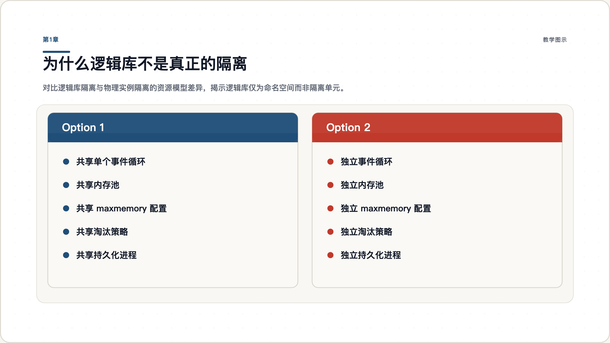
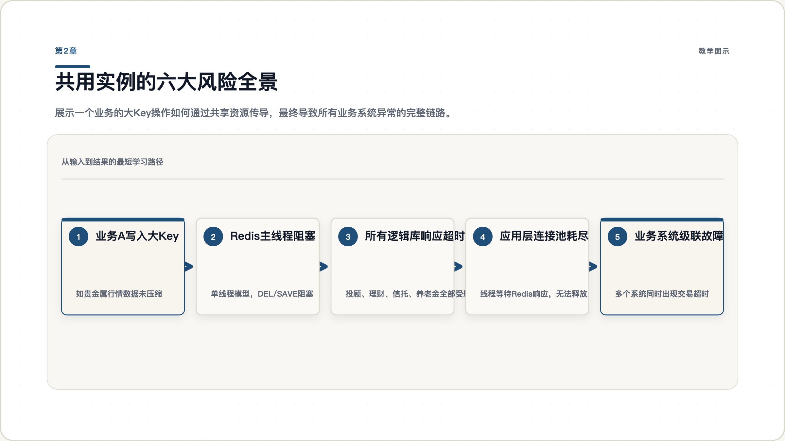
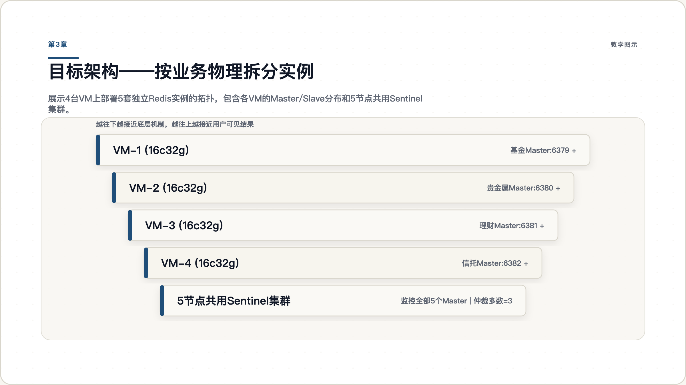
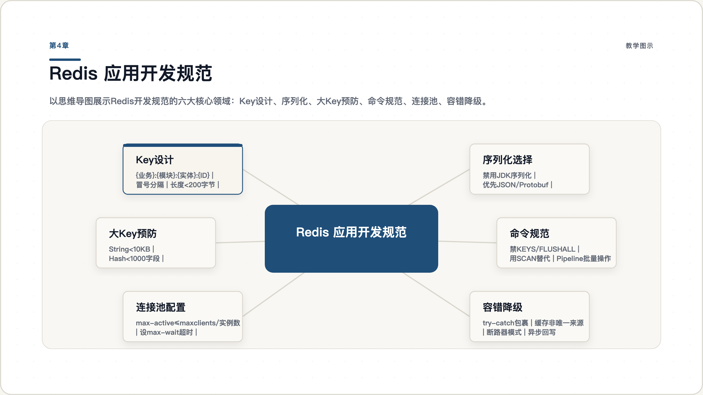
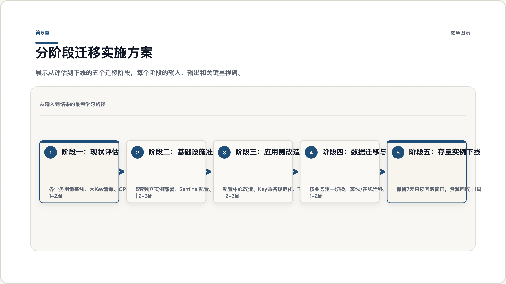
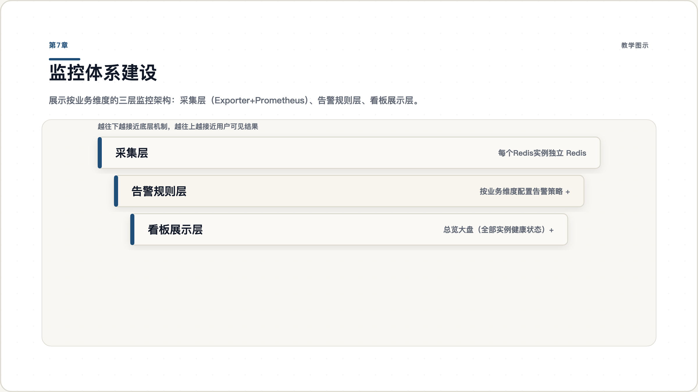
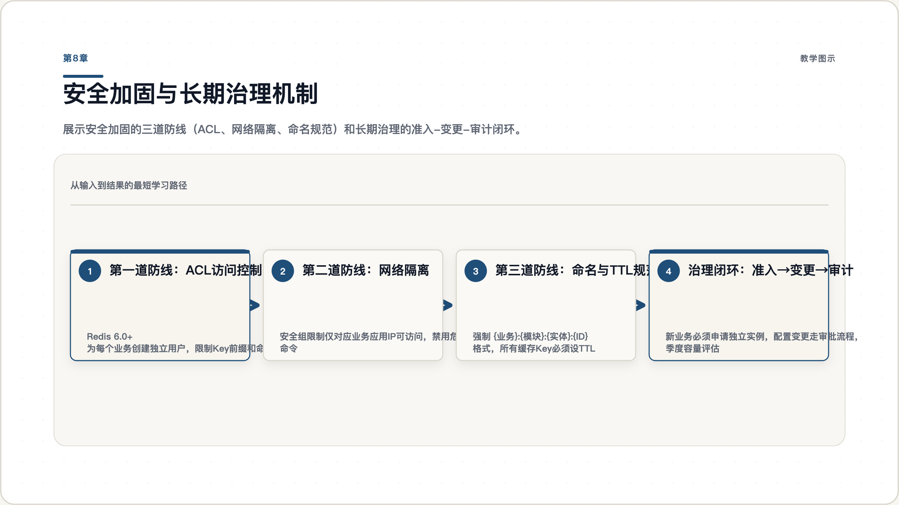

# 城市商业银行 Redis 多业务共用实例风险治理与物理隔离整改实战指南

2026年5月20日

---

生产环境再次告警——贵金属系统的行情缓存写入突然变慢，连锁反应波及了公募基金投顾和理财代销系统的响应时间。运维团队排查发现，一个业务的大Key操作阻塞了整个Redis实例，而这个实例上运行着五个不同的业务系统。这不是第一次，也不会是最后一次——如果不从根本上改变架构。

读完本指南，你将能够：识别共用Redis实例的全部风险点，设计按业务维度物理拆分的目标架构，制定可落地的分阶段迁移方案，并建立监控与安全的长效治理机制。

---

## 第1章 为什么逻辑库不是真正的隔离

### 1.1 从一次生产故障说起

某城商行的五大财富管理系统——公募基金投顾、贵金属、理财代销、财富信托、商业养老金——共用同一个Redis哨兵实例，通过不同的逻辑库编号（DB0-DB4）做区分。这套方案在上线初期运行平稳，但随着业务量增长，问题开始频繁出现。

一次典型故障链路：贵金属系统在行情剧烈波动时段写入了大量未压缩的行情数据（单个Key超过100KB），Redis主线程在处理这些大Key的写入和过期删除时出现明显阻塞。由于Redis是单线程处理命令的，这个阻塞同时影响了其他四个业务系统的读写请求。公募基金投顾的客户查询超时，理财代销的交易状态缓存失效，故障在数分钟内扩散至所有关联业务。

这类故障在生产环境已多次发生。问题的根源不在于某个业务系统的代码质量，而在于架构层面——逻辑库隔离本身就不是真正的隔离。

### 1.2 Redis逻辑库的真正角色

Redis的逻辑库（通过`SELECT`命令切换的DB0-DB15）本质上是**命名空间**，不是隔离单元。Redis官方文档明确指出，逻辑数据库的设计初衷是为了在同一个实例上方便开发者按用途分组管理Key，而非为不同应用提供隔离运行环境。

逻辑库之间共享的内容包括：

- **CPU时间片**：Redis单线程模型下，所有逻辑库的命令排队等待同一个线程处理
- **内存空间**：全局`maxmemory`限制覆盖所有逻辑库，一个库占满即全部拒绝写入
- **网络带宽**：所有逻辑库的客户端共享同一个网络连接池和出口带宽
- **持久化进程**：RDB快照和AOF重写进程影响的是整个实例的内存
- **全局配置**：淘汰策略、超时时间、连接数上限等参数为实例级，无法按逻辑库差异化设置



图 1.1：逻辑库隔离与物理实例隔离的资源模型对比。左侧为现状——所有逻辑库共享同一份资源；右侧为目标——每个业务独占独立资源。

### 1.3 单线程模型的连锁效应

Redis采用单线程事件循环模型处理命令。这意味着在任意时刻，只有一个命令在被执行。如果一个逻辑库中的命令耗时过长（如删除一个大Key、执行`KEYS *`、或对大数据集执行`SORT`），它会阻塞所有逻辑库中正在排队的命令。

这就是为什么"逻辑库隔离"在低负载场景下看似可行，但在生产环境的高并发场景下会暴露致命缺陷——隔离的假象在压力下会被瞬间打破。

> **检查点**：你的Redis实例是否通过逻辑库隔离了不同业务？执行`redis-cli INFO keyspace`查看各DB的Key数量，如果多个DB都有显著数据量，那么本章描述的风险就在你的环境中真实存在。

---

## 第2章 共用实例的六大风险全景

### 2.1 资源竞争风险

五个业务系统共享同一个Redis实例的CPU、内存和网络。在正常负载下，各业务可能相安无事；但一旦某个业务出现流量突增（如贵金属系统在行情剧烈波动时、理财代销在产品开放日），它会抢占大部分资源，导致其他业务的请求排队等待甚至超时。

共享内存是最核心的风险点。Redis的`maxmemory`是实例级配置，所有逻辑库共享这个上限。当一个业务的缓存数据量激增，占满了`maxmemory`，Redis会根据全局淘汰策略删除Key——而这些被删除的Key可能属于完全无关的业务。

### 2.2 配置冲突风险

Redis的以下关键配置均为实例级全局参数，无法按逻辑库独立设置：

| 配置项 | 全局影响 | 业务差异化需求 |
|--------|---------|---------------|
| `maxmemory` | 所有逻辑库共享内存上限 | 各业务内存需求差异大（2G-8G不等） |
| `maxmemory-policy` | 所有逻辑库同一淘汰策略 | 缓存型业务适合LRU，数据型业务需保留 |
| `save` / `appendonly` | 持久化影响整个实例的I/O | 不同业务对持久化要求不同 |
| `maxclients` | 所有业务共享连接数上限 | 需按业务QPS独立控制 |

生产环境曾多次出现因淘汰策略设置不合理导致内存告警的问题。根本原因是一个全局策略无法同时满足五个业务的不同需求。

### 2.3 故障传导风险

共用实例意味着**单点故障的影响范围被放大了五倍**。实例宕机、主从切换、持久化失败、网络抖动——任何一个基础设故障都会同时影响所有五个业务系统。

在哨兵模式下，主从切换期间（通常持续数十秒到数分钟），所有业务的写入请求都会失败。如果这五个业务系统本可以通过错峰部署来降低故障叠加概率，那么共用实例恰恰消除这种可能性。

### 2.4 大Key与慢查询的连锁反应

大Key是Redis生产环境最常见的问题之一。以下操作在遇到大Key时会严重阻塞主线程：

| 操作 | 大Key场景 | 阻塞时间量级 |
|------|----------|-------------|
| `DEL` 大Key | 删除一个100MB的String | 数百毫秒到数秒 |
| `HGETALL` 大Hash | 遍历10万field的Hash | 数十到数百毫秒 |
| `LRANGE` 大List | 获取10万元素的列表 | 数十到数百毫秒 |
| `KEYS *` | 扫描所有Key | 随数据量线性增长 |

在共用实例中，一个业务的大Key操作会通过阻塞主线程，直接导致其他四个业务的所有请求超时。这种连锁反应在生产环境中已多次发生。



图 2.1：风险传导链路——一个大Key操作如何通过共享资源最终导致多业务同时故障。

### 2.5 监控盲区

当前监控只能做到实例级别——你看到的是Redis实例的整体内存使用率、QPS和延迟，但无法回答"内存告警是哪个业务导致的"、"QPS突增来自哪个应用"这类关键问题。

`redis-cli INFO keyspace`只能看到各DB的Key数量，无法看到各DB的内存占用、命令分布和热点Key。在故障发生时，运维团队需要在五个业务系统中逐个排查，延长了平均恢复时间（MTTR）。

### 2.6 安全边界缺失

任何一个能连接Redis实例的客户端，都可以通过`SELECT`命令切换到任意逻辑库并读写数据。在生产环境中，这意味着：

- 五个不同业务系统的应用服务器都能访问彼此的缓存数据
- 运维人员无法限制某个业务只能访问特定的逻辑库
- 发生数据泄露或误操作时，难以定位责任归属

Redis官方文档不推荐不同业务系统通过多逻辑库方式共用同一实例，正是基于安全隔离的考虑。

> **检查点**：统计过去半年内你的Redis实例出现的故障告警，有多少次影响到了多个业务系统？如果比例超过50%，说明风险传导已经是常态。

---

## 第3章 目标架构——按业务物理拆分实例

### 3.1 拆分原则与目标拓扑

物理拆分的核心原则是：**每个业务系统独占一个Redis实例**。具体包括：

- **独立进程**：每个Redis实例运行在独立的操作系统进程中，拥有独立的事件循环
- **独立配置**：每个实例独立设置`maxmemory`、淘汰策略、连接数上限等参数
- **独立哨兵**：每个实例配套独立的Sentinel集群，主从切换互不影响
- **独立网络**：通过端口区分和安全组规则限制访问范围
- **独立存储**：每个实例的RDB/AOF文件独立存储

目标部署拓扑：

| 业务系统 | 端口 | 主从架构 | Sentinel | 内存配额 | 淘汰策略建议 |
|---------|------|---------|----------|---------|-------------|
| 公募基金投顾 | 6379 | 1主2从 | 5节点共用 | 4GB | volatile-lru |
| 贵金属系统 | 6380 | 1主2从 | 5节点共用 | 2GB | allkeys-lru |
| 理财代销系统 | 6381 | 1主2从 | 5节点共用 | 4GB | volatile-lru |
| 财富信托系统 | 6382 | 1主2从 | 5节点共用 | 4GB | noeviction |
| 商业养老金系统 | 6383 | 1主2从 | 5节点共用 | 2GB | volatile-ttl |

> 内存配额需根据阶段一的评估数据调整，上表为建议值。

### 3.2 硬件资源评估与部署规划

当前硬件资源为 4 台虚拟机，每台 16 核 32GB 内存。需要评估这些资源是否足以支撑 5 套独立实例的部署。

**资源盘点**：

| 资源 | 现有总量 | 当前用途 | 新方案需求 |
|------|---------|---------|-----------|
| 虚拟机 | 4 台 | 1 主 + 3 从 + 3 哨兵 | 5×(1主2从) + 5 哨兵 = 20 进程 |
| CPU | 4×16c = 64 核 | Redis 单线程，利用率通常不高 | 15 数据实例 + 5 哨兵，CPU 不是瓶颈 |
| 内存 | 4×32G = 128G | 共享一个 maxmemory | 5 业务独立配额，需要逐 VM 规划 |

Redis 采用单线程模型处理命令，每个实例只用 1 个核心。15 个数据实例理论需要 15 个核心，加上持久化的 fork 子进程和 Sentinel 进程，4 台 VM 共 64 核完全够用，**瓶颈在内存而不在 CPU**。

**推荐方案：沿用 4 台 VM，每台运行多个 Redis 实例（不同端口）**。

核心原则是确保同一业务的 Master 和 Slave 分布在不同 VM 上，避免单机故障导致业务完全不可用。具体部署方案如下：

| VM 节点 | 部署内容 | 实例数 | Redis 内存估算 |
|---------|---------|-------|---------------|
| VM-1 | 公募基金 Master + 理财代销 Slave + 商业养老 Slave + Sentinel-1 | 3 数据 + 1 哨兵 | ~10GB |
| VM-2 | 贵金属 Master + 公募基金 Slave + 财富信托 Slave + Sentinel-2 | 3 数据 + 1 哨兵 | ~8GB |
| VM-3 | 理财代销 Master + 贵金属 Slave + 商业养老 Slave + Sentinel-3 | 3 数据 + 1 哨兵 | ~8GB |
| VM-4 | 财富信托 Master + 商业养老 Master + Sentinel-4 + Sentinel-5 | 2 数据 + 2 哨兵 | ~6GB |

每台 VM 的内存分配预算：

```
操作系统 + 基础服务预留      ≈ 4 GB
Redis 数据实例 × 2-3 个     ≈ 6-10 GB（取决于各业务 maxmemory 配置）
复制缓冲区开销               ≈ 数据量的 10-15%
Sentinel 进程               ≈ 可忽略（< 50MB）
───────────────────────────────
合计                         ≤ 18 GB（在 32GB 内有充足余量）
```

**扩容方案：如果数据量超出预期，扩容到 6 台 VM**：

当各业务实际数据量之和超过 16GB 时（或预期增长明显），建议将 VM 扩容到 6 台（保持 16c32g 配置），将 15 个数据实例更均匀地分散，每台 VM 只承载 2-3 个数据实例。

| 当前总数据量 | 每业务分配 maxmemory | 4 台 VM 是否够用 | 建议 |
|-------------|---------------------|-----------------|------|
| < 8 GB | 2-4 GB / 业务 | 够用，余量充足 | 沿用 4 台 VM |
| 8-16 GB | 4-6 GB / 业务 | 基本够用，偏紧凑 | 沿用 4 台 VM，加强内存水位监控 |
| 16-24 GB | 4-8 GB / 业务 | 偏紧，存在风险 | 扩容到 6 台 VM |
| > 24 GB | 8 GB+ / 业务 | 不够 | 必须扩容或使用更高配置 VM |

> 经验值：5 个业务各配 4GB maxmemory，15 个数据实例分布到 4 台 VM，每台承载 3-4 个实例（12-16GB Redis 内存），加上复制缓冲和系统开销，32GB 可以覆盖但偏紧凑。建议先执行阶段一评估，根据实际数据量做最终决策。



图 3.1：4 台 VM 承载 15 个数据实例和 5 个哨兵节点。Master 与 Slave 分散在不同 VM，5 节点 Sentinel 集群可容忍 2 台宕机。

### 3.3 每个业务独立实例的配置策略

拆分后，每个实例可以根据业务特点做差异化配置。关键配置项的差异化思路：

**内存配额**：根据阶段一评估的实际用量，预留50%-100%的增长空间。例如理财代销系统评估用量为2.5GB，配额设为4GB。

**淘汰策略**：
- 缓存型业务（行情数据、会话缓存）→ `allkeys-lru` 或 `volatile-lru`
- 数据型业务（交易状态、账户信息）→ `noeviction`（配合容量规划确保不超限）
- 混合型业务 → `volatile-ttl`（优先淘汰TTL较短的Key）

**持久化**：
- 允许少量数据丢失的业务 → 仅开启RDB，降低`save`频率
- 要求数据可靠性的业务 → 开启AOF，`appendfsync everysec`

**连接数**：根据业务应用的连接池配置设定`maxclients`，建议设为连接池最大连接数的1.5倍。

### 3.4 哨兵节点部署规划

Sentinel 是 Redis 高可用的监控组件，负责自动故障检测和主从切换。部署哨兵时需要回答两个关键问题：部署几个哨兵节点？是每业务独立还是多业务共用？

**推荐方案：5 节点共用 Sentinel 集群**。

| 方案 | 哨兵数量 | 优点 | 缺点 | 推荐度 |
|------|---------|------|------|-------|
| 3 节点共用 | 3 | 资源消耗最少 | 宕机 1 台即无法形成仲裁多数 | 不推荐 |
| **5 节点共用** | **5** | **可容忍 2 台宕机，仲裁更稳健** | **Sentinel 本身是单点** | **推荐** |
| 每业务独立 3 节点 | 15 | 完全隔离，互不影响 | 资源消耗大，运维复杂度高 | 资源充裕时可选 |

为什么推荐 5 节点共用而不是每业务独立？

Sentinel 是轻量监控进程，单个实例内存占用通常不到 10MB，不处理业务数据流量。它的核心工作是检测 Master 是否存活、在故障时协调 Slave 升级为 Master。**业务隔离的核心是数据实例，不是监控组件**。5 个 Sentinel 监控 5 个 Master 比管理 15 个 Sentinel 分 5 组更简单，也更容易维护。

仲裁原理：Sentinel 需要奇数节点形成多数派投票。5 个 Sentinel 的仲裁多数为 3，意味着可以容忍 2 台宕机而仍然正常工作；3 个 Sentinel 的仲裁多数为 2，只能容忍 1 台宕机。对于 4 台 VM 的部署环境，5 节点比 3 节点更安全。

**哨兵节点在 4 台 VM 上的分布**：

| VM 节点 | 哨兵进程 | 说明 |
|---------|---------|------|
| VM-1 | sentinel-1 | 监控全部 5 个 Master |
| VM-2 | sentinel-2 | 监控全部 5 个 Master |
| VM-3 | sentinel-3 | 监控全部 5 个 Master |
| VM-4 | sentinel-4 + sentinel-5 | 两个哨兵进程，补齐到 5 节点 |

sentinel-4 和 sentinel-5 部署在同一台 VM-4 上，使用不同端口（如 26379 和 26380）。这两个哨兵在同一台 VM 上，如果 VM-4 宕机，同时丢失 2 票，剩余 3 票仍能形成仲裁多数。

**Sentinel 配置示例**：

```
# sentinel.conf（所有 5 个哨兵节点使用相同配置）
# 公募基金投顾
sentinel monitor fund-master 10.0.1.10 6379 2
sentinel down-after-milliseconds fund-master 10000
sentinel failover-timeout fund-master 60000
sentinel parallel-syncs fund-master 1

# 贵金属系统
sentinel monitor metal-master 10.0.1.11 6380 2
sentinel down-after-milliseconds metal-master 10000
sentinel failover-timeout metal-master 60000
sentinel parallel-syncs metal-master 1

# 理财代销系统
sentinel monitor sales-master 10.0.1.12 6381 2
sentinel down-after-milliseconds sales-master 10000
sentinel failover-timeout sales-master 60000
sentinel parallel-syncs sales-master 1

# 财富信托系统
sentinel monitor trust-master 10.0.1.13 6382 2
sentinel down-after-milliseconds trust-master 10000
sentinel failover-timeout trust-master 60000
sentinel parallel-syncs trust-master 1

# 商业养老金系统
sentinel monitor pension-master 10.0.1.14 6383 2
sentinel down-after-milliseconds pension-master 10000
sentinel failover-timeout pension-master 60000
sentinel parallel-syncs pension-master 1
```

每个 Sentinel 配置中的 `2` 表示至少需要 2 个 Sentinel 同意才能执行故障转移，配合 5 节点部署可以容忍网络分区和节点宕机。

> **检查点**：部署完成后，执行 `redis-cli -p 26379 sentinel master fund-master` 验证哨兵能正确识别各业务的 Master 节点。逐个验证 5 个 Master 的监控状态均为 "ok"。

---

## 第4章 Redis 应用开发规范

架构整改解决的是基础设施层面的隔离问题，但Redis的稳定性同样依赖于应用层的正确使用。生产环境中多数故障——大Key阻塞、连接泄漏、慢查询——根源在代码层面。本章梳理应用开发中必须遵循的Redis使用规范，作为开发团队的编码约束。

### 4.1 Key 设计规范

**命名规则**：`{业务}:{模块}:{实体}:{ID}`

```
# 正确示例
fund:quote:nav:000001          # 公募基金-行情-净值-基金代码
metal:price:gold:AU99.99       # 贵金属-价格-黄金-品种
sales:order:status:20240315001 # 理财代销-订单-状态-订单号
trust:account:balance:12345    # 财富信托-账户-余额-账户号
pension:plan:yield:PLAN001     # 商业养老-方案-收益率-方案号

# 错误示例
user_data                     # 无业务前缀，无法识别归属
cache:temp:abc                 # 模糊命名，难以定位用途
fund_quote_nav_000001          # 使用下划线分隔（应使用冒号）
```

为什么使用冒号分隔？Redis的Key以冒号作为层级分隔符，在`SCAN`命令和监控工具中可以按前缀过滤和统计。Spring Data Redis等框架也以冒号作为默认的分隔符。

**Key长度控制**：单个Key不超过200字节。过长的Key会增加内存占用和网络传输开销。业务ID较长时，考虑使用哈希摘要。

**禁止动态拼接无限Key空间**：

```java
// 错误：按时间戳生成无限Key，导致内存持续增长
String key = "fund:tick:" + System.currentTimeMillis();
redis.set(key, data);

// 正确：固定Key + 定期覆盖
String key = "fund:tick:latest:" + fundCode;
redis.setex(key, 300, data);  // 5分钟过期
```

### 4.2 序列化与数据格式选择

不同序列化方式对内存和性能的影响差异显著：

| 序列化方式 | 空间效率 | 序列化速度 | 反序列化速度 | 可读性 | 推荐场景 |
|-----------|---------|-----------|-----------|-------|---------|
| JSON | 低 | 中 | 中 | 好 | 需要跨语言、人工可读 |
| Protobuf | 高 | 快 | 快 | 差 | 高频读写、跨语言 |
| Kryo | 高 | 快 | 快 | 差 | Java单一语言环境 |
| JDK序列化 | 最低 | 慢 | 慢 | 差 | **不推荐** |
| 纯字符串 | 最高 | 最快 | 最快 | 好 | 简单值（计数器、标志位） |

**强制要求**：

- 禁止使用Java原生序列化（JDK Serialization）。它产生的字节数组体积大（通常为JSON的2-3倍），且存在反序列化安全风险
- 缓存对象建议使用JSON或Protobuf。JSON便于调试和跨语言协作；Protobuf适用于高频读写且对内存敏感的场景
- 存储纯数值（计数器、标志位、时间戳）时，直接使用字符串，不要包装为对象

```java
// 错误：将整个对象存为Value
UserSession session = new UserSession(userId, name, token, loginTime);
redis.set("session:" + userId, serialize(session));  // JDK序列化后可能 2KB+

// 正确：使用Hash存储对象字段
Map<String, String> fields = new HashMap<>();
fields.put("name", name);
fields.put("token", token);
fields.put("loginTime", String.valueOf(loginTime));
redis.hmset("session:" + userId, fields);  // 紧凑、可部分读取
```

### 4.3 大Key预防与数据结构选型

大Key是Redis生产故障的首要原因。在开发阶段就必须预防：

| 场景       | 推荐数据结构               | 禁止使用         | 原因               |
| -------- | -------------------- | ------------ | ---------------- |
| 对象属性存储   | Hash（field < 1000）   | String存整个对象  | 部分读写，内存更紧凑       |
| 计数器      | String + INCR        | Hash         | 原子递增，O(1)        |
| 排行榜      | ZSet（member < 5000）  | List         | 天然排序，范围查询O(logN) |
| 去重集合     | Set（member < 5000）   | List         | O(1)去重检查         |
| 时间线/消息列表 | List（element < 5000） | ZSet         | LPUSH + LRANGE高效 |
| 配置字典     | Hash                 | 多个String     | 集中管理，减少Key数量     |
| 带权重的标签   | ZSet                 | Set + 外部权重映射 | 一次查询获取排序结果       |

**大Key预防阈值**（代码审查检查项）：

| 数据类型 | 预警阈值 | 禁止阈值 |
|---------|---------|---------|
| String | > 10 KB | > 100 KB |
| Hash field 数量 | > 1,000 | > 5,000 |
| List element 数量 | > 1,000 | > 5,000 |
| Set member 数量 | > 1,000 | > 5,000 |
| ZSet member 数量 | > 1,000 | > 5,000 |

**集合类型的拆分策略**：当一个集合元素超过阈值时，必须拆分。

```java
// 错误：将所有基金的实时行情存入一个Hash
// fund:quote:all → {000001: "...", 000002: "...", ... 5000个基金}
// 内存占用可能超过 1MB
redis.hmset("fund:quote:all", allQuotesMap);

// 正确：按分桶存储，每个桶100个基金
// fund:quote:bucket:00 → {000001~000100}
// fund:quote:bucket:01 → {000101~000200}
int bucket = fundCode.hashCode() % 50;
redis.hmset("fund:quote:bucket:" + bucket, bucketMap);
redis.expire("fund:quote:bucket:" + bucket, 300);  // 5分钟过期
```

### 4.4 命令使用规范

**禁止使用的命令**（生产环境）：

| 命令                     | 危险原因                  | 替代方案                   |
| ---------------------- | --------------------- | ---------------------- |
| `KEYS *`               | 遍历所有Key，O(N)阻塞主线程     | `SCAN` 渐进遍历            |
| `FLUSHALL` / `FLUSHDB` | 清空数据，不可恢复             | 运维审批后执行                |
| `HGETALL`（大Hash）       | 一次返回所有field，可能返回MB级数据 | `HSCAN` 或按需 `HMGET`    |
| `LRANGE 0 -1`（大List）   | 返回全部元素                | 分页 `LRANGE start stop` |
| `SMEMBERS`（大Set）       | 返回全部成员                | `SSCAN` 渐进遍历           |
| `SORT`                 | 对大集合排序，O(N*logN)      | 应用层排序或使用ZSet           |

**必须使用Pipeline/批量操作**的场景：

```java
// 错误：循环单次操作，每次都是一次网络往返
for (String fundCode : fundCodes) {
    String nav = redis.get("fund:quote:nav:" + fundCode);
    results.add(nav);
}
// 100个基金 = 100次网络往返，耗时约 100×1ms = 100ms

// 正确：使用Pipeline，一次网络往返
Pipeline pipeline = redis.pipelined();
for (String fundCode : fundCodes) {
    pipeline.get("fund:quote:nav:" + fundCode);
}
List<Object> results = pipeline.syncAndReturnAll();
// 100个基金 = 1次网络往返，耗时约 2-5ms
```

**批量操作优先**：

| 批量命令 | 适用场景 | 注意事项 |
|---------|---------|---------|
| `MGET` / `MSET` | 批量读取/写入String | 单次不超过500个Key |
| `HMGET` / `HMSET` | 批量读取/写入Hash字段 | field数量不超过100 |
| `Pipeline` | 混合命令批量执行 | 单次Pipeline不超过500条命令 |
| `Pipelined + MULTI` | 需要原子性的批量操作 | 控制事务中的命令数量 |

### 4.5 连接池配置规范

合理的连接池配置直接关系到应用的稳定性和Redis实例的健康。

```yaml
# Spring Boot 连接池配置参考（Lettuce）
spring:
  redis:
    sentinel:
      master: fund-master
      nodes: 10.0.1.10:26379,10.0.1.11:26379,10.0.1.12:26379
    lettuce:
      pool:
        max-active: 20    # 最大连接数 = 预估并发线程数 × 1.2
        max-idle: 10      # 最大空闲连接 = max-active × 0.5
        min-idle: 5       # 最小空闲连接，避免冷启动延迟
        max-wait: 3000ms  # 获取连接超时时间
      shutdown-timeout: 5000ms
    timeout: 3000ms       # 命令超时时间
```

**配置原则**：

- `max-active` 不超过Redis实例`maxclients`的 1/业务应用实例数。例如5个应用实例连接同一个Redis（maxclients=500），每个实例的max-active不超过100
- `max-wait` 必须设置，避免连接池耗尽时线程无限等待
- `timeout` 建议设置为 2-5 秒，避免慢命令长时间阻塞线程
- 使用Sentinel模式时，必须配置Sentinel连接池参数（与数据连接池分开）

### 4.6 容错与降级策略

Redis作为缓存层，应用必须具备Redis不可用时的降级能力。

```java
// 正确的缓存降级模式
public String getFundNav(String fundCode) {
    String cacheKey = "fund:quote:nav:" + fundCode;
    try {
        String cached = redis.get(cacheKey);
        if (cached != null) {
            return cached;
        }
    } catch (RedisException e) {
        // 记录告警日志，不抛出异常
        log.warn("Redis读取失败，降级为数据库查询: {}", e.getMessage());
        monitor.increment("redis.fallback");
    }
    
    // 降级：从数据库或其他数据源获取
    String nav = database.queryFundNav(fundCode);
    
    // 异步回写缓存（Redis恢复后自动补齐）
    try {
        redis.setex(cacheKey, 300, nav);
    } catch (RedisException e) {
        log.warn("Redis回写失败，跳过缓存: {}", e.getMessage());
    }
    
    return nav;
}
```

**容错原则**：

- Redis操作必须包裹在try-catch中，异常不应中断业务流程
- 缓存层的作用是加速，不是数据唯一来源。关键业务数据必须有数据库作为兜底
- 设置合理的超时时间，避免线程长时间阻塞在Redis调用上
- 使用断路器模式（如Resilience4j、Hystrix）在Redis持续异常时自动降级
- Sentinel主从切换期间（通常10-60秒），应用应能自动重连



图 4.1：Redis 开发规范全景——从Key设计、序列化、命令选择到容错降级的完整规范体系。

> **检查点**：对现有代码执行一次Redis使用审查——检查是否存在`KEYS *`调用、未设TTL的缓存Key、超过1KB的String Value、循环单次Redis操作。这些问题必须在迁移前修复。

---

## 第5章 分阶段迁移实施方案

### 5.1 阶段一：现状评估与基线采集（1-2周）

迁移的第一步不是部署新实例，而是摸清现有环境的真实状况。需要采集以下数据：

```bash
# 各逻辑库的Key数量和过期Key统计
redis-cli INFO keyspace

# 识别大Key（建议在低峰期执行）
redis-cli --bigkeys -i 0.1

# 内存使用详情
redis-cli MEMORY DOCTOR

# 延迟基线
redis-cli --latency-history -i 1

# 客户端连接信息
redis-cli CLIENT LIST
```

同时需要从应用侧采集：连接池配置、日均QPS与峰值QPS、Key命名规则、TTL分布、是否使用Lua脚本或Pub/Sub等高级特性。

输出《各业务系统Redis用量评估表》，包含内存占用、Key数量、日均QPS、峰值QPS、大Key清单（超过10KB的Key列表及归属）、现有淘汰策略与TTL命中率。

### 5.2 阶段二：基础设施准备（2-3周）

基于评估数据部署5套独立Redis实例。每个实例的核心配置：

```
# redis.conf 关键参数示例
port 6379
maxmemory 4gb
maxmemory-policy volatile-lru
maxclients 500
timeout 300
tcp-keepalive 60

# 慢查询日志
slowlog-log-slower-than 10000
slowlog-max-len 256

# 客户端输出缓冲区限制
client-output-buffer-limit normal 0 0 0
client-output-buffer-limit replica 256mb 64mb 60

# 安全：禁用危险命令
rename-command FLUSHDB ""
rename-command FLUSHALL ""
rename-command DEBUG ""
```

配套部署对应的Sentinel集群，验证主从切换功能。配置监控采集（详见第6章）和防火墙/安全组规则。

### 5.3 阶段三：应用侧改造（2-3周）

应用侧需要完成以下改造：

**配置中心化**：将Redis连接信息从硬编码改为配置中心管理，支持按业务维度独立配置连接地址、端口、密码。

**Key命名规范化**：采用统一格式 `{业务}:{模块}:{实体}:{ID}`，例如：
- `fund:quote:nav:000001`
- `metal:price:gold:AU99.99`
- `sales:order:status:202403150001`

**TTL治理**：所有缓存类Key必须设置TTL，业务数据类Key明确过期策略。输出无TTL的Key清单并逐个处理。

### 5.4 阶段四：数据迁移与业务切换（1-2周）

**推荐方案：离线迁移**，按业务逐一切换，每业务一个维护窗口。

```
迁移步骤：
1. 维护窗口内停止目标业务应用
2. 导出对应逻辑库数据
3. 将数据导入新实例
4. 修改配置中心指向新实例
5. 启动应用，验证功能
6. 观察30分钟无异常后，进入下一业务
```

**切换顺序**（按风险从低到高）：商业养老金 → 贵金属 → 理财代销 → 财富信托 → 公募基金投顾。

**在线迁移备选方案**：使用redis-shake工具进行增量同步，适用于不可停机的业务。核心步骤是在新实例建立与当前主库的同步关系，数据追平后短暂停止写入，切换全量至新实例。



图 5.1：五个迁移阶段的完整流程，从评估到下线，每阶段有明确交付物。

### 5.5 阶段五：存量实例下线与回滚保障

所有业务切换完成后：

1. 旧实例设为只读状态，保留7天作为回滚窗口
2. 配置中心保留旧实例连接信息的快速切换入口
3. 回滚操作SOP：停止应用 → 切回旧实例 → 启动应用 → 验证，预计5分钟内完成
4. 每次切换前执行一次旧实例数据快照（BGSAVE）
5. 7天后确认无异常，下线旧实例，回收资源

> **检查点**：每个业务切换前是否准备了回滚方案？回滚操作是否经过演练验证？

---

## 第6章 过渡期管控与大Key治理

### 6.1 迁移窗口期内的应急管控措施

在物理隔离尚未完成前，需要立即落地以下管控措施来快速降低风险：

**内存水位监控**：设置三级告警阈值——70%预警、80%告警、90%紧急（触发应急流程）。

**危险命令禁用**：在redis.conf中禁用`FLUSHALL`、`FLUSHDB`、`DEBUG`等危险命令，禁止生产环境执行`KEYS *`。

**连接数管控**：各业务应用的连接池配置需要与实例`maxclients`匹配，避免单一业务耗尽所有连接。

### 6.2 大Key识别与拆分治理

建立每日大Key巡检机制：

```bash
# 每日定时巡检（低峰期执行）
redis-cli --bigkeys -i 0.1 > /tmp/bigkeys_$(date +%Y%m%d).log

# 阈值标准
# String  > 10KB 告警，> 100KB 禁止写入
# Hash    > 5000 field 告警
# List    > 5000 element 告警
# Set     > 5000 member 告警
# ZSet    > 5000 member 告警
```

**大Key拆分策略**：
- 大String → 压缩后存储（如行情数据用gzip/snappy压缩）或按维度拆分为多个Key
- 大Hash → 按分桶策略拆分为多个小Hash（如`user:{id}:profile:bucket1`）
- 大List → 改用分页存储或按时间分片
- 大Set/ZSet → 按区间或分桶拆分

### 6.3 淘汰策略紧急调整

过渡期内的淘汰策略调整原则：

- 将全局策略调整为`volatile-lru`（只淘汰有TTL的Key），保护无TTL的核心数据
- 要求所有非核心缓存Key必须设置TTL
- 核心业务数据Key不设TTL，避免被误淘汰
- 迁移完成后，每个业务按第3章的差异化策略独立配置


图 6.1：按数据类型的大Key识别阈值与治理手段矩阵，以及过渡期淘汰策略的紧急调整方案。

> **检查点**：你的生产环境中是否存在超过100KB的Key？执行`redis-cli --bigkeys`统计一次，评估大Key治理的优先级。

---

## 第7章 监控体系建设

### 7.1 按业务维度的监控架构设计

拆分后的监控架构分为三层：

**采集层**：每个Redis实例配置独立的Redis Exporter，采集指标推送到Prometheus。每个采集Job打上业务标签（如`business=fund_advisor`），实现按业务维度的数据聚合。

**告警规则层**：按业务维度配置告警策略，告警通知路由到对应业务的责任人。当公募基金投顾的实例内存超过80%时，告警只发送给投顾团队，而不是广播给所有人。

**看板展示层**：分为总览大盘和业务独立看板。总览大盘一眼看到所有实例的健康状态；业务看板支持下钻查看内存趋势、QPS曲线、慢查询分布等细节。

### 7.2 核心监控指标与告警阈值

| 类别 | 指标 | 告警阈值 | 说明 |
|------|------|---------|------|
| 内存 | `used_memory / maxmemory` | > 80% 告警 | 按业务独立监控 |
| 连接 | `connected_clients / maxclients` | > 80% 告警 | 检测连接泄漏 |
| 延迟 | P99延迟 | > 10ms | 通过`latency`命令采集 |
| QPS | `instantaneous_ops_per_sec` | 突增3倍预警 | 检测异常流量 |
| 慢查询 | `slowlog` | > 10ms 记录，> 100ms 告警 | 定位性能瓶颈 |
| 主从延迟 | 主从偏移量差值 | > 1MB 告警 | 检测同步异常 |
| 大Key | 自定义巡检脚本 | > 10KB 告警 | 每日巡检 |
| 淘汰 | `evicted_keys` | > 0 预警 | 表示内存不足 |
| Key过期 | `expired_keys` | 突增告警 | 检测TTL设置异常 |

### 7.3 Grafana 业务看板设计

**总览大盘**：以卡片形式展示每个业务实例的核心指标（内存使用率、QPS、延迟、健康状态），状态用绿/黄/红标识。支持从总览点击下钻到具体业务看板。

**业务独立看板**：每个业务系统配置独立的Grafana Dashboard，包含内存趋势图、QPS曲线图、慢查询Top10排行、Key空间分布、主从同步状态等面板。



图 7.1：三层监控架构——采集层、告警规则层、看板展示层，实现从实例级到业务级的精细化监控。

> **检查点**：你的监控系统能否在1分钟内回答"当前Redis内存告警是哪个业务导致的"？如果不能，说明监控粒度需要细化。

---

## 第8章 安全加固与长期治理机制

### 8.1 ACL 访问控制与网络隔离

Redis 6.0及以上版本支持ACL（Access Control List），可以为每个业务创建独立的用户并限制其访问范围：

```
# 为每个业务创建独立用户
ACL SETUSER fund_advisor on >{强密码} ~fund:* +@all -@dangerous
ACL SETUSER precious_metal on >{强密码} ~metal:* +@all -@dangerous
ACL SETUSER wealth_sales on >{强密码} ~sales:* +@all -@dangerous
ACL SETUSER trust on >{强密码} ~trust:* +@all -@dangerous
ACL SETUSER pension on >{强密码} ~pension:* +@all -@dangerous
```

每个用户只能访问以自己业务前缀开头的Key，并禁止执行`FLUSHALL`、`CONFIG`等危险命令。

**网络隔离**：每个Redis实例绑定独立的内网地址，安全组规则仅允许对应业务的应用服务器IP访问。禁止Redis端口暴露至公网。

### 8.2 Key命名规范与TTL治理

**Key命名强制规范**：`{业务}:{模块}:{实体}:{ID}`

例如：`fund:quote:nav:000001`、`metal:price:gold:AU99.99`

命名规范的价值在于：即使未来出现共用实例场景，也能通过Key前缀快速定位归属业务。在新实例上，ACL配合Key前缀实现双重隔离。

**TTL强制策略**：
- 所有缓存类Key必须设置TTL（建议不超过24小时）
- 业务数据类Key需明确过期策略并在架构文档中登记
- 无TTL的Key需要白名单审批
- 每周巡检无TTL的Key清单，清理僵尸数据

### 8.3 Redis 使用准入与变更管理机制

建立长期治理的闭环机制，防止问题回潮：

**准入管控**：
- 新业务系统接入Redis必须申请独立实例
- 禁止新增业务使用现有共享实例
- Redis实例的申请需经过架构评审

**容量管理**：
- 每季度评估各实例的容量增长率
- 内存使用率超过60%触发扩容评估
- 容量规划纳入版本迭代流程

**变更管理**：
- Redis配置变更走标准变更流程，需审批后执行
- 应用上线前检查Redis使用模式（大Key检测、TTL检查、连接池配置合理性）
- 建立Redis使用规范文档，作为新项目的必读材料



图 8.1：三道安全防线（ACL、网络隔离、命名规范）配合准入-变更-审计的治理闭环，从源头防止风险回潮。

> **检查点**：你的组织是否有Redis使用规范文档？新项目接入Redis是否需要经过架构评审？如果没有，本节的治理机制模板可以直接采用。

---

## 实践环节

### 自检清单：你的Redis是否存在共用实例风险

逐项检查，超过3项为"是"即存在较高风险：

- [ ] 多个业务系统共用同一个Redis实例
- [ ] 通过逻辑库（SELECT DB）做业务隔离
- [ ] 生产环境出现过因Redis阻塞导致多业务受影响的故障
- [ ] 无法按业务维度查看内存占用和QPS分布
- [ ] Redis的淘汰策略是全局统一的，未按业务差异化配置
- [ ] 多个业务的应用服务器都能访问彼此的Redis数据
- [ ] 未对Key大小建立监控和限制机制
- [ ] 存在未设置TTL的缓存类Key

### 实战练习：制定迁移计划

基于你的实际环境，填写以下迁移计划模板：

| 阶段 | 负责人 | 预计周期 | 关键交付物 | 风险点 |
|------|-------|---------|-----------|-------|
| 现状评估 | _____ | _____周 | 用量评估报告、大Key清单 | _____ |
| 基础设施准备 | _____ | _____周 | 5套实例+Sentinel部署完毕 | _____ |
| 应用侧改造 | _____ | _____周 | 配置中心化、Key规范化 | _____ |
| 数据迁移 | _____ | _____周 | 各业务切换至独立实例 | _____ |
| 旧实例下线 | _____ | _____周 | 资源回收确认 | _____ |

### 七大关键验收标准

1. 每个业务系统连接的是独立的Redis实例（不同端口或不同IP）
2. 每个实例的`maxmemory`和淘汰策略独立配置
3. 故障演练：停止一个业务实例，其他业务不受影响
4. 监控能按业务维度展示内存、QPS、延迟、慢查询
5. ACL配置完毕，各业务只能访问自己的Key前缀
6. 大Key巡检脚本每日自动运行，无超过阈值的Key
7. 旧实例已下线或处于只读回滚窗口期

---

## 参考资料

- Redis官方文档 - Database Specification：https://redis.io/docs/latest/commands/select/
- Redis官方文档 - Memory Management：https://redis.io/docs/latest/management/optimization/memory-management/
- Redis官方文档 - Sentinel：https://redis.io/docs/latest/management/sentinel/
- Redis官方文档 - ACL Security：https://redis.io/docs/latest/management/security/acl/
- Redis官方文档 - Latency Optimization：https://redis.io/docs/latest/management/optimization/latency/
- RedisShake 迁移工具：https://github.com/tair-opensource/RedisShake
