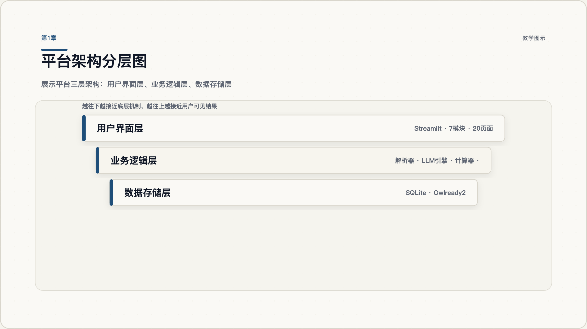
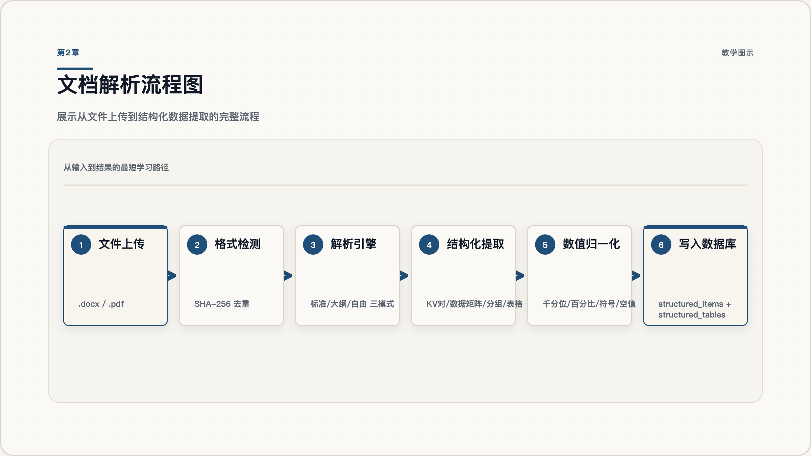
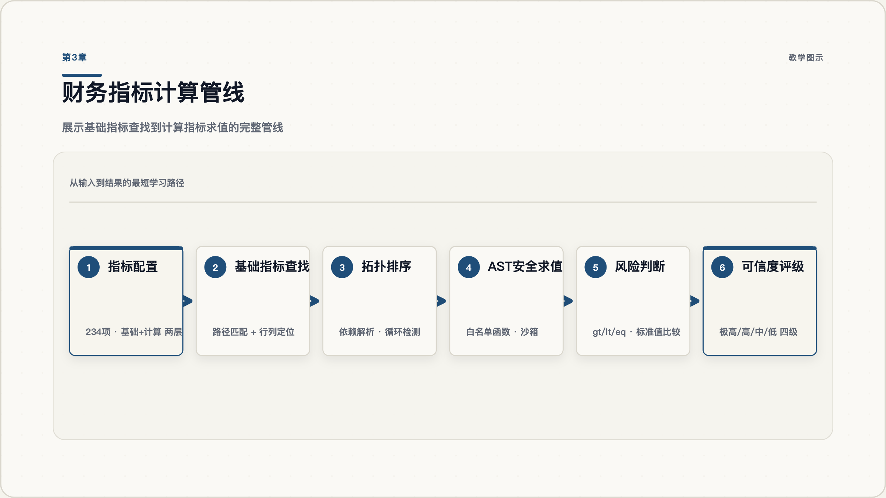
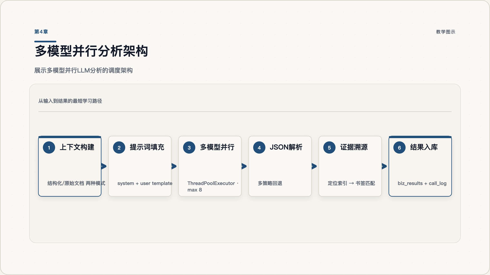
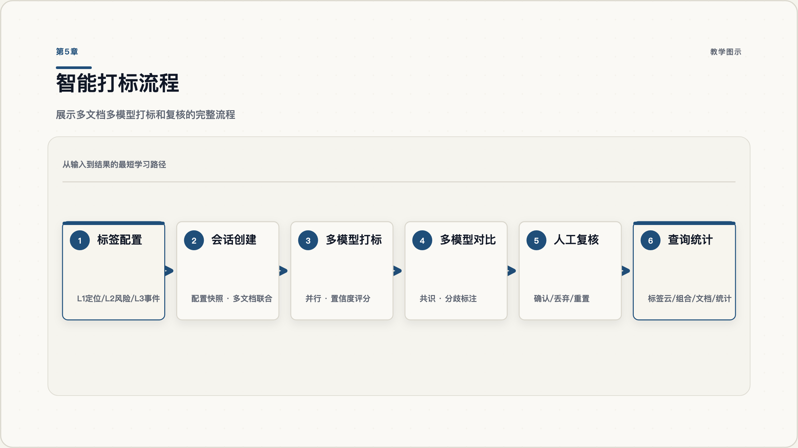
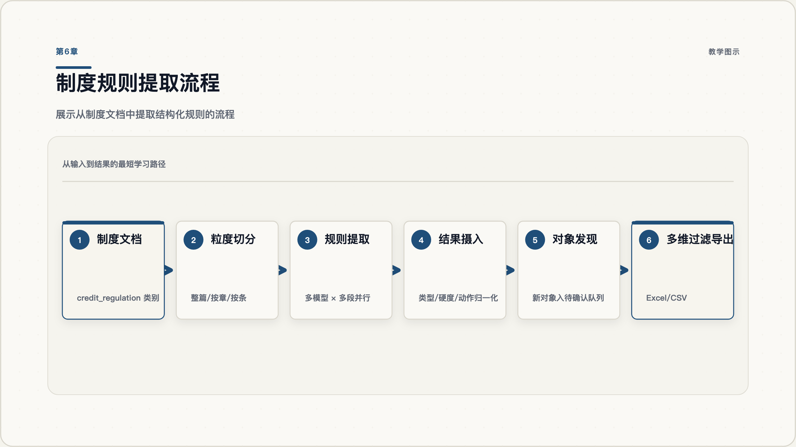
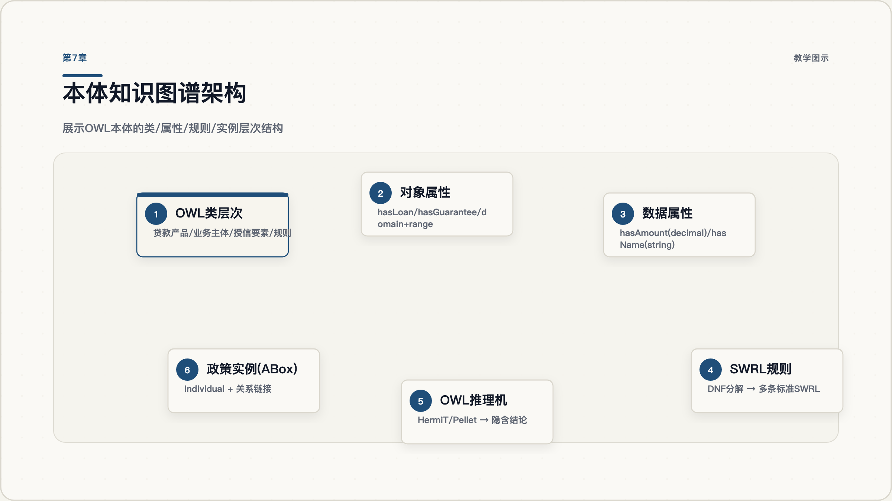
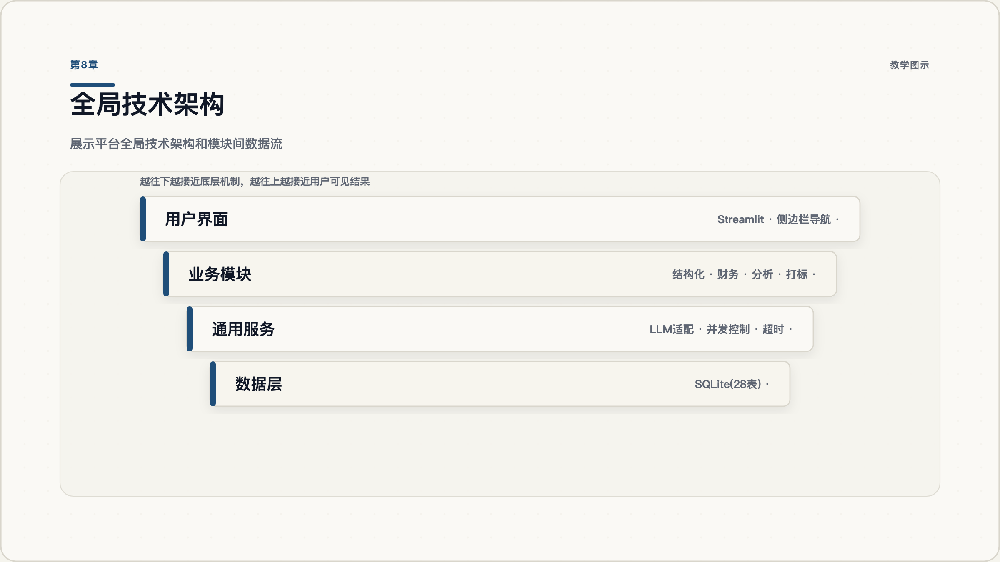

# 策速 · 尽调分析平台 — 功能设计文档

2026年5月21日

---

## 第1章 项目总览与架构定位



### 1.1 平台定位与业务背景

策速 · 尽调分析平台是一个面向银行信贷业务的智能尽调分析系统。它解决的核心问题是：银行在审批贷款时，需要审阅大量调查报告、审查意见、批复文件和信贷制度，这些文档格式不统一、数据分散、交叉核验工作量大，依赖人工逐字逐表比对，效率低且容易遗漏风险。

平台的目标是将非结构化的信贷文档转化为可计算、可查询、可推理的结构化知识，辅助信贷审批人员识别风险。

### 1.2 技术栈全景

| 层次       | 技术选型                     | 用途                                        |
| -------- | ------------------------ | ----------------------------------------- |
| 前端框架     | Streamlit                | Web UI、页面路由、会话状态管理                        |
| LLM 接口   | DashScope OpenAI 兼容 API  | 调用通义千问、DeepSeek、GLM、Kimi、MiniMax 等 18 个模型 |
| 关系数据库    | SQLite                   | 文档元数据、结构化数据、分析结果、标签、制度规则（28 张表）           |
| 本体引擎     | Owlready2 + RDFlib       | OWL 2.0 本体建模、SWRL 规则、HermiT/Pellet 推理机    |
| 文档解析     | python-docx + pdfplumber | Word 和 PDF 文档的结构化提取                       |
| 图谱可视化    | streamlit-agraph         | 本体类/属性/关系的交互式图谱展示                         |
| 数据处理     | Pandas + openpyxl        | 数据清洗、Excel 导出                             |
| 并发控制     | ThreadPoolExecutor       | 多模型并行 LLM 调用（最大 8 并发）                     |
| HTTP 客户端 | OpenAI SDK + httpx       | LLM API 调用，自定义超时策略                        |

### 1.3 模块总览

平台包含 7 个核心功能模块：

1. **文件材料结构化** — 文档上传、解析、结构化提取、LLM 数据复核
2. **财务指标加工** — 基础指标查找 + 计算指标公式求值 + 风险判断
3. **调查报告与财务分析** — 多模型并行 LLM 风险分析 + 证据溯源
4. **历史材料智能打标** — 多维度标签体系 + 多模型打标 + 复核工作流
5. **制度规则拆解** — 信贷制度文档条款级规则提取
6. **信贷本体建模** — OWL 本体管理 + SWRL 规则 + OWL 推理 + 制度驱动知识扩展
7. **模型配置** — LLM API 密钥管理 + 18 个模型的目录和参数管理

### 1.4 全局数据流

```
原始文档 (.docx/.pdf)
    │
    ▼
┌──────────────┐     ┌─────────────────┐
│ 文件材料结构化 │────▶│ structured_items │ ← 财务指标、主业分析、打标的共同数据源
│ (解析+提取)   │     │ structured_tables│
└──────────────┘     └────────┬────────┘
     │                        │
     ▼                        ▼
┌──────────────┐     ┌──────────────┐
│ LLM 数据复核  │     │ 财务指标加工  │ ──▶ fin_indicator_values
└──────────────┘     └──────┬───────┘
                            │
                            ▼
                     ┌──────────────────┐
                     │ 调查报告与财务分析 │ ──▶ biz_results
                     │ (多模型 LLM)      │
                     └──────────────────┘

┌──────────────┐     ┌──────────────────┐
│ 制度规则拆解  │────▶│ regulation_results│
└──────┬───────┘     └────────┬─────────┘
       │                      │
       ▼                      ▼
┌──────────────────────────────────┐
│ 信贷本体建模 (OWL + SWRL + 推理)  │
│ TBox: 类/属性/规则类型            │
│ ABox: 政策实例/条款实例/规则实例   │
└──────────────────────────────────┘
```

---

## 第2章 文件材料结构化



### 2.1 支持的文档类型与上传流程

平台支持 4 类信贷文档，每类有独立的解析策略：

| 类别标识 | 中文名称 | 典型内容 |
|---------|---------|---------|
| `investigation_financial` | 调查报告与财报 | 12 章标准信用报告（业务信息、财务分析、担保情况等） |
| `review_opinion` | 审查意见 | 审查部门对调查报告的意见 |
| `approval_reply` | 批复 | 上级机构对授信申请的批复文件 |
| `credit_regulation` | 信贷制度 | 银行内部信贷管理制度文件 |

上传流程：
1. 用户在 UI 上传 `.docx` 或 `.pdf` 文件
2. 系统计算 SHA-256 哈希去重
3. 根据文件格式调用对应解析器
4. 执行结构化数据提取，写入 `structured_items` 和 `structured_tables` 表
5. 对 `.docx` 文件生成书签副本（`bookmarked.docx`），用于后续溯源

### 2.2 解析引擎：docx 与 pdf 双通道

**Word 解析器**（`src/parser/docx_parser.py`）：

解析策略分三层：
- **标准模式**（`standard`）：匹配 12 章信用报告骨架（`SECTION_DEFS` 定义了 12 个正则模式），至少命中 3 个不同章节号才触发
- **大纲模式**（`outline`）：通过 Word 样式的 `w:outlineLvl` 和字体大小推断标题层级
- **自由文本模式**（`free_form`）：无法识别章节结构时，归为单个"全文"章节

关键技术细节：
- 直接遍历 `w:body` XML 元素，而非使用 python-docx 的高层 API，以获取精确的全局行号索引
- 处理"包装表格"模式：某些文档整个 body 是单列表格，真正的内容在嵌套表格中
- 表格表头检测：基于单元格底色（深色背景或浅蓝色背景，排除灰色）
- 隐藏文本过滤：排除 `w:vanish`、`w:webHidden`、修订删除（`w:del`、`w:moveFrom`）中的文本

**PDF 解析器**（`src/parser/pdf_parser.py`）：

- 使用 `pdfplumber` 提取文本、表格和字符级字体信息
- 标题检测基于字体大小：字号 >= 正文字号 × 1.15 且 >= 正文字号 + 2pt
- PDF 无 Word 书签，使用 `page:block` 坐标格式作为锚点
- 输出结构与 docx 解析器完全一致，下游代码格式无关

**信贷制度专用分章**（`src/parser/credit_sectioning.py`）：

针对 `credit_regulation` 类别文档的特殊处理：
- 区分"第一章 总则"（独立章节）和"附件：1. xxx"（列举项，不创建章节）
- 匹配 `第N章` 和 `附件N` 模式，排除 `附件：N` 列举格式

### 2.3 结构化提取与归一化

**结构化提取器**（`src/parser/struct_extractor.py`）：

将解析后的章节内容转化为树状结构数据，写入数据库：

```
section_root (group)
├── group_header "（一）业务概况"
│   ├── key_value "借款人：xxx公司"
│   ├── key_value "申请金额：5000万元"
│   └── table → structured_tables
├── zh_major_heading "六、行业分析"
│   └── independent "企业经营稳定..."
└── article_heading "第十五条"
```

表格分类算法（4 种类型）：
1. **key_value_pairs**：偶数列，标签-值交替排列
2. **data_matrix**：表头行 + 2 行以上数据（5 列以上或含数值数据的宽表）
3. **header_single_row**：表头行 + 恰好 1 行数据（按列提取 KV）
4. **single_column_prose**：单列文本

**数值归一化器**（`src/parser/normalizer.py`）：

处理文档中各种数值表示：
- 千分位分隔：`1,234.56` → `1234.56`
- 括号负数：`(1,234.00)` → `-1234.0`
- 百分比：`26.61%` → `0.2661`（存储为小数，便于计算）
- 符号映射：`⊙` → selected，`○` → unselected，`√` → checked，`□` → unchecked
- 空值检测：多层规则（字面空值 `-`/`无`/`N/A`、仅含单位的壳 `万元`、纯标点）

### 2.4 LLM 数据复核与审计

对每个章节可触发 LLM 复核（`src/llm/reviewer.py`）：

1. 将章节内容序列化为文本（段落 + 表格，含锚点 ID）
2. 调用 LLM 检查：数值超出合理范围、逻辑矛盾、文字与数字不一致、疑似录入错误、必填项缺失
3. 生成复核任务（`review_tasks` 表），每条含：原始值、建议值、LLM 判断、理由
4. 用户可执行：采纳（adopt）、修正（correct）、忽略（ignore）、回退（rollback）
5. 每次决策变更写入不可变审计日志（`review_audit_log` 表）

### 2.5 后端技术栈

| 组件 | 技术 | 说明 |
|------|------|------|
| Word 解析 | python-docx + XML 直接遍历 | 全局段落/行索引，支持书签精确定位 |
| PDF 解析 | pdfplumber | 字体大小检测标题，表格提取 |
| 数值处理 | 自定义归一化引擎 | 冻结 v1 规则，不做单位转换 |
| 书签写入 | python-docx XML 操作 | 在原文档副本中插入 `w:bookmarkStart/End` |
| HTML 渲染 | 自定义 HTML 生成器 | 内联 CSS/JS，锚点定位+高亮 |
| 数据库 | SQLite (28 张表) | 60s 超时防锁，手动级联删除 |
| LLM 复核 | DashScope API | 单模型调用，返回结构化复核任务 |

---

## 第3章 财务指标加工



### 3.1 两层指标配置体系

平台定义了 234 项标准财务指标，分为两层：

**基础指标**（`fin_basic_indicator_configs` 表）：
- 从结构化表格中直接查找的数值
- 配置项：匹配值（`match_value`）、父级标签、祖父级标签、报告期、精确/模糊匹配

**计算指标**（`fin_calc_indicator_configs` 表）：
- 通过公式从基础指标计算得出
- 配置项：公式字符串、标准值、风险方向、可信度等级、计算模式

四种计算模式：
- `free`：无期数约束，单次求值
- `fixed`：固定报告期，变量绑定到指定期
- `all_five`：跨 5 个报告期分别求值
- `begin_end`：期初/期末配对求均值（3 组）

五个报告期：本期、上年同期、上年末、上两年末、上三年末

### 3.2 基础指标查找引擎

**`src/fin/lookup.py`**：

查找算法：
1. 加载文档所有 `structured_items`，构建 `id_map`（按 item_id）和 `path_map`（祖先链）
2. 按优先级尝试多条查找规则
3. 每条规则：沿祖先链匹配 parent/grandparent → 在表格中匹配行标签 → 在表头中匹配报告期列 → 返回对应单元格值

支持精确匹配和模糊匹配（子串匹配），返回命中/未命中状态及完整追溯信息。

### 3.3 计算指标公式引擎

**`src/fin/calculator.py`**（约 946 行）：

**AST 安全求值**：
- 通过 Python `ast` 模块解析公式字符串为语法树
- 白名单函数：`sqrt`、`pow`、`abs`、`min`、`max`、`round`、`log`、`exp`
- 禁止访问 `__builtins__`、禁止函数调用、禁止属性访问
- 校验 AST 节点类型，只允许数学运算和白名单函数

**拓扑排序**：
- 从公式中提取变量标识符（排除白名单函数名）
- 构建依赖图，执行拓扑排序解决指标间依赖
- 检测循环依赖并报错

**执行流程**：
1. 查找所有基础指标值
2. 校验并拓扑排序计算指标
3. 按依赖顺序依次求值
4. 每个指标记录：原始值、数值、公式、代入过程、风险判断、可信度
5. 写入 `fin_indicator_values` 表

### 3.4 风险判断与可信度评级

**风险判断**（`_judge_risk`）：
- 将计算结果与标准值比较
- 支持 3 种方向：`gt`（大于标准值为风险）、`lt`（小于标准值为风险）、`eq`（不等于为风险）
- 返回 (level, reason) 元组

**可信度评级**：
- 四个等级：极高（75-100 分）、高（50-74）、中（25-49）、低（0-24）
- 每个计算指标配置可信度等级和评分
- 校验评分是否落在等级对应的分数区间内

### 3.5 后端技术栈

| 组件 | 技术 | 说明 |
|------|------|------|
| 公式求值 | Python ast 模块 | AST 解析 + 白名单校验 + 沙箱执行 |
| 依赖解析 | 自定义拓扑排序 | 检测循环依赖，保证求值顺序 |
| 数值查找 | 自定义路径匹配引擎 | 祖先链 + 行标签 + 列标题三维匹配 |
| 配置管理 | SQLite (5 张表) | 基础/计算指标配置、分析运行记录、指标值 |
| 种子数据 | 脚本从 Word 参考文档导入 | `scripts/seed_fin_configs_from_234.py` |

---

## 第4章 调查报告与财务分析



### 4.1 两种上下文构建模式

**结构化模式**（默认，`build_biz_structured_context`）：

1. 从数据库读取 `structured_items` 和 `structured_tables`，过滤主营相关章节（第 1-7 章）
2. 构建 parent-child 树，遍历生成**紧凑格式**：
   ```
   三、主营业务情况/主要产品：钢材贸易
   七、财务分析/资产负债表/R17：41294
   ```
3. 同时构建 `locator_index`（`定位路径 → Word 书签名` 映射），用于后续证据溯源
4. 紧凑模式节省 token，每行一条数据，不含书签编号

**原始文档模式**（`build_biz_raw_doc_context`）：

1. 找到原始 `.docx` 文件，用 `python-docx` 直接读取所有段落和表格
2. 对支持 file-extract 的模型（如 qwen-long），上传文件到 DashScope 云端，用 `fileid://` 协议让模型直接读取原文
3. 不做结构化处理，保留完整原文信息

### 4.2 多模型并行分析架构

**`run_biz_analysis`**（`src/llm/biz_analyzer.py:782`）：

```
                    ┌─────────────────────┐
                    │   准备上下文          │
                    │   构建提示词          │
                    └──────────┬──────────┘
                               │
              ┌────────────────┼────────────────┐
              ▼                ▼                ▼
        ┌──────────┐    ┌──────────┐    ┌──────────┐
        │ Model A  │    │ Model B  │    │ Model C  │
        │ (线程1)   │    │ (线程2)   │    │ (线程3)   │
        │          │    │          │    │          │
        │ step1 →  │    │ step1 →  │    │ step1 →  │
        │ step2 →  │    │ step2 →  │    │ step2 →  │
        │ done     │    │ done     │    │ done     │
        └──────────┘    └──────────┘    └──────────┘
              │                │                │
              └────────────────┼────────────────┘
                               ▼
                    写入 biz_results 表
```

关键设计：
- **链间并行、链内串行**：不同模型在不同线程中并行运行，但同一模型内的步骤按顺序执行
- **并发控制**：`ThreadPoolExecutor(max_workers=min(N, 8))`，加信号量防止 API 限流
- **停止机制**：通过 `threading.Event` 实现优雅停止（步骤间隙检查，当前 LLM 请求仍会跑完）
- **可选财务摘要**：勾选"包含财务分析"时，从 `fin_indicator_values` 读取已计算结果，附加到上下文末尾

### 4.3 提示词设计与检查逻辑

`config.yaml` 中定义了一个单步骤提示词（`biz_analysis_prompts`），要求 LLM 按固定结构输出 JSON 数组：

| 输出位置 | check_name | 类型 | risk_level |
|---------|-----------|------|-----------|
| 第 1 条 | 分析总结：主营业务 | 分析总结 | summary |
| 第 2 条 | 分析总结：核心盈利逻辑与市场地位 | 分析总结 | summary |
| 第 3+ 条 | 必查一：资产结构核验 | 必查 | high/medium/low/suspect |
| 第 3+ 条 | 必查二：利润来源核验 | 必查 | high/medium/low/suspect |
| 第 3+ 条 | 必查三：购销品种核验 | 必查 | high/medium/low/suspect |
| 第 3+ 条 | 自由识别：\<自定义\> | 自由风险 | high/medium/low/suspect |

每条风险必须包含 `calc_trace`（计算过程）和 `evidence`（证据溯源）。风险等级归一化为 6 级：high、medium、low、no_risk、suspect、summary。

### 4.4 证据溯源机制

这是本模块的关键特色——将 LLM 输出的证据项定位回原始 Word 文档的精确位置：

```
LLM 输出 evidence.item_label = "七、财务分析/资产负债表/R17"
                          ↓
locator_index 查找 → "bm_00042"
                          ↓
UI "↗" 按钮 → open_at_bookmark("bookmarked.docx", "bm_00042")
                          ↓
VBScript 打开 Word 并跳转到该位置（Windows）
```

匹配策略（5 层回退）：
1. 精确匹配路径
2. 去掉末尾冒号
3. NFKC Unicode 标准化后匹配
4. 最长前缀匹配（LLM 可能多带了说明后缀）
5. 数据库弱匹配（按字段名 + 值回查 `structured_items`）

### 4.5 后端技术栈

| 组件 | 技术 | 说明 |
|------|------|------|
| LLM 调用 | OpenAI SDK → DashScope | OpenAI 兼容接口，3 种思考模式分发 |
| 并发执行 | ThreadPoolExecutor | max 8 并发，链间并行链内串行 |
| JSON 解析 | 多策略回退 | json.loads → raw_decode → 正则 [.*] |
| 证据溯源 | 自定义定位索引 | 紧凑路径 → 书签名映射 + 5 层回退匹配 |
| 文件上传 | DashScope file-extract API | 部分模型支持云端直接读取原始文档 |
| 数据存储 | SQLite (3 张表) | biz_tests、biz_results、biz_model_call_log |

---

## 第5章 历史材料智能打标



### 5.1 三层标签体系与配置

**三层架构**：
- **L1 定位层**：行业分类（如"制造业"、"批发零售业"）
- **L2 风险层**：风险特征（如"关联交易集中"、"经营周期性"）
- **L3 事件层**：具体事件（如"诉讼"、"股权变更"）

**三种标签类型**：
- `multi_value`：多值标签，带候选值池（如行业分类可有多个值）
- `grade`：等级标签（如风险等级 A/B/C/D）
- `binary`：二元标签（是/否）

每个标签配置包含：判断标准、LLM 提示词模板、候选值、最大候选数。

### 5.2 多模型并行打标流程

**`src/llm/industry_tagger.py`**：

1. 创建打标会话（`tag_sessions` 表），快照当前配置和候选值
2. 构建上下文：从调查报告 + 关联的审查意见 + 批复中提取结构化数据，按文档类别前缀区分来源
3. 为每个模型构建用户提示词（标签定义 + 候选值 + 材料上下文）
4. 并行调用多个模型，每个模型为每个标签返回结果
5. 计算置信度评分（基于证据数量、是否有书签溯源、标签层级）
6. 结果写入 `industry_tag_results` 表

### 5.3 复核工作流与置信度评分

**置信度计算**（`calculate_confidence`）：

```python
confidence = 基础分(证据数量) + 书签加分(has_source_bms) + 层级调节(category)
```

**复核流程**：
1. 浏览会话列表，按状态/复核状态过滤
2. 进入会话详情：按 L1/L2/L3 分组显示标签
3. 每个标签展示多模型对比卡片：共识（多模型一致）和分歧
4. 对每条结果执行：确认（confirm）、丢弃（discard，带理由）、重置（reset）
5. 确认的多值标签自动加入候选值池
6. 可标记会话为"已完成复核"

### 5.4 查询与统计视图

四种查询方式：
- **标签云**：按频率缩放字号，按类别着色
- **组合查询**：多标签 AND 匹配，按命中数排序
- **按文档查看**：单个文档的 L1/L2/L3 标签及多模型结果
- **统计分析**：标签计数、类别分布柱状图、模型输出分布、置信度分布

### 5.5 后端技术栈

| 组件 | 技术 | 说明 |
|------|------|------|
| 上下文构建 | 复用 biz_analyzer 的结构化上下文 | 多文档类型联合输入 |
| 多模型并行 | ThreadPoolExecutor | 同 biz_analyzer 模式 |
| 置信度评分 | 自定义评分函数 | 证据数量 + 书签 + 层级三因子 |
| 会话快照 | SQLite (7 张表) | 配置和候选值快照，保证分析可追溯 |
| 复核工作流 | 数据库状态机 | pending → confirmed/discarded，带审计 |

---

## 第6章 制度规则拆解



### 6.1 制度文档解析与粒度控制

制度文档（`credit_regulation` 类别）经过文件材料结构化模块解析后，按 3 种粒度送入规则提取引擎：

- **整篇模式**（`whole`）：整个文档作为一次输入
- **按章模式**（`by_chapter`）：按"第N章"切分，每个章节独立分析
- **按条模式**（`by_article`）：按"第N条"切分，粒度最细

切分逻辑（`split_by_chapter` / `split_by_article`）：
- 从解析后的 section 中提取文本
- 标题分类：`chapter`（第N章）、`article`（第N条）、`subitem`（（一）/（二））
- 按分类结果将文本分段

### 6.2 规则提取引擎

**`src/llm/regulation_analyzer.py`**（约 637 行）：

**提示词设计**（`prompts/regulation_system_prompt.txt`）：

要求 LLM 对每个条款输出：
- `result_type`：`rule`（控制性规则）或 `explanation`（说明性内容）
- `rule_expressible`：该规则能否形式化为数值/等式条件（yes/no）
- `control_hardness`：`hard`（硬约束，必须遵守）或 `soft`（软约束，建议性）
- `action_type`：`reject`（拒绝类）或 `assign`（指派类）
- `trigger_expression`：触发条件的半形式化表达
- `involved_objects`：涉及的基础对象

**执行流程**：
1. 创建分析会话，快照基础对象和提示词
2. 按选择的粒度切分文档
3. 多模型并行分析，每个模型内部按段并行（最多 8 段并发）
4. 结果入库：每条规则写入 `regulation_analysis_results` 表
5. LLM 发现的新基础对象写入 `regulation_pending_objects` 待确认队列

**结果摄入**（`_ingest_results`）：
- 为每条结果生成 UUID
- 解析涉及对象：已存在的基础对象直接关联，新发现的进入待确认队列
- 归一化 result_type 和 action_type

### 6.3 基础对象管理

基础对象是规则中引用的数据变量（如"借款人年龄"、"授信额度"、"贷款余额"）：

- 手动 CRUD：名称、数据类型（integer/decimal/string/boolean）、单位、描述
- LLM 发现队列：`regulation_pending_objects` 表，支持逐条确认/拒绝和批量操作
- 对象快照：每次分析会话快照最多 500 个基础对象，作为 LLM 上下文

### 6.4 后端技术栈

| 组件 | 技术 | 说明 |
|------|------|------|
| 文档切分 | 自定义正则分段器 | 章/条/款三级切分 |
| 规则提取 | DashScope API | 多模型 × 多段并行 |
| 对象管理 | SQLite (4 张表) | 基础对象、待确认对象、会话、结果 |
| 提示词管理 | 文件系统 | `prompts/regulation_system_prompt.txt` |
| 导出 | Pandas + openpyxl | Excel/CSV 多维过滤导出 |

---

## 第7章 信贷本体建模



### 7.1 本体论在信贷领域的应用动机

传统信贷分析系统的核心矛盾：LLM 的分析结果是一次性 JSON，无法形成知识积累。

引入本体引擎解决 4 个问题：

**概念标准化**：不同制度文件对同一概念用不同术语（"借款人"vs"申请人"vs"授信客户"），本体通过类层次统一。

**关系建模**：JSON 只有扁平字段，本体通过对象属性显式表达"借款人 → hasLoan → 贷款产品"等语义关系。

**规则形式化**：自然语言规则（"固定资产贷款超1亿须报总行"）无法自动执行，SWRL 规则可实现形式化推理。

**知识积累**：每解析一个新制度，本体自动扩展，形成可复用的信贷知识图谱。

### 7.2 OWL 本体存储与 CRUD

**存储架构**：

每个本体是一个独立的 SQLite 文件（通过 Owlready2 的 `World` 对象管理）：

```python
world = World(filename="data/ontologies/xxx.sqlite")
onto = world.get_ontology("http://qingdao.credit/ontology")
world.save()   # 持久化到 SQLite quadstore
world.close()
```

**实体管理**（`src/ontology/owl_store.py`，约 711 行）：

| 操作 | 实现方式 |
|------|---------|
| 新建类 | `types.new_class(name, (parent,))`，根类挂 `owl:Thing` |
| 重命名类 | 直接赋值 `cls.name = new_name` |
| 删除类 | `destroy_entity(cls)` |
| 修改继承 | 操作 `cls.is_a` 列表，防环检查 |
| 对象属性 | 创建 `ObjectProperty` 子类，设 `domain` 和 `range` |
| 数据属性 | 创建 `DataProperty` 子类，设 `domain` 和 XSD 类型 |
| 中文标签 | `locstr(label, lang="zh")` 写入 `entity.label` |

**多文档导入处理**：

一个 OWL 文件可能 import 多个本体。`_pick_primary_ontology` 按实体数量选取主本体，避免元数据 IRI 修改后落入空壳。

**网络导入控制**：

通过 monkey-patch `Ontology.load` 方法，可选禁止 Owlready2 发起 HTTP 请求下载 `owl:imports` 依赖，避免导入外部 OWL 文件时触发网络访问。

### 7.3 SWRL 规则编译与推理

**规则编译器**（`src/ontology/swrl_builder.py`，约 358 行）：

将 UI 中构建的布尔规则树转换为标准 SWRL 规则字符串：

```
输入（规则树）：
AND(
  ATOM: ?p is Person
  ATOM: ?p.hasAge > 80
  OR(
    ATOM: ?p.hasLoan -> ?l
    ATOM: ?p.hasCredit > 10000000
  )
)
                          ↓ DNF 分解
输出（2 条 SWRL 规则）：
Person(?p) ∧ hasAge(?p, ?a) ∧ greaterThan(?a, 80) ∧ hasLoan(?p, ?l) → ...
Person(?p) ∧ hasAge(?p, ?a) ∧ greaterThan(?a, 80) ∧ hasCredit(?p, ?c) ∧ greaterThan(?c, 10000000) → ...
```

关键算法：
- **DNF 分解**：OR-of-ANDs → 析取范式，每个合取子句生成一条独立规则
- **NOT 处理**：
  - 数值比较：运算符翻转（`>` → `<=`）
  - 类成员否定：创建 `owl:complementOf` 补类（`Not_X = owl:complementOf(X)`）
- **跨类变量绑定**：通过 ObjectProperty 桥接（如 `?p.hasLoan → ?l`）
- **SWRL 内建映射**：`greaterThan`、`lessThanOrEqual`、`contains` 等

**OWL 推理机**（`ontology_reasoning_verify.py`）：

通过 Owlready2 调用 Java 推理机：
- HermiT：`sync_reasoner()` 或 `sync_reasoner_hermit()`
- Pellet：`sync_reasoner_pellet()`，支持数据属性推理
- 推理后对比类层次变化和实例类型推断
- 检测不一致类

### 7.4 制度驱动本体完善（TBox）

**`src/ontology/policy_refinement_apply.py`**：

TBox 层操作——扩展本体的模式/结构：

1. 输入：制度文档的结构化数据 + 当前本体快照
2. LLM 分析后建议新增：类、对象属性、数据属性、规则类型
3. **校验阶段**（`validate_refinement_plan`）：
   - 名称合法性检查
   - 重名检测
   - 父类/domain/range 存在性检查
   - XSD 类型白名单校验
4. **执行阶段**（`apply_refinement_plan`）：
   - 批量创建新类（含中文标签和注释）
   - 创建对象属性（domain + range）
   - 创建数据属性（domain + XSD 类型）
   - 创建规则类型类

### 7.5 制度实例化（ABox）

**`src/ontology/policy_instance_store.py`**：

ABox 层操作——在本体中创建具体实例：

1. 输入：LLM 将制度条款解析为政策实例、条款实例、规则实例、定性判断项
2. 调用 `cls(instance_id)` 创建 Individual（个体）
3. 通过 `setattr(individual, property, [other_individual])` 建立实例间的关系链接
4. 为每个实例设置中文标签（`locstr`）
5. 记录未解析的链接错误

完整流程：
```
制度文档结构化数据 → LLM 按条款解析 → JSON 输出
    → policy_instances (政策实例)
    → clause_instances (条款实例)
    → rule_instances (规则实例)
    → qualitative_judgment_items (定性判断项)
    → links (实例间关系)
    → apply_policy_instantiation_result() → 写入本体 quadstore
```

### 7.6 后端技术栈

| 组件 | 技术 | 说明 |
|------|------|------|
| 本体存储 | Owlready2 SQLite quadstore | 每个本体独立 .sqlite 文件 |
| 类/属性管理 | Owlready2 API | Thing、ObjectProperty、DataProperty |
| 规则引擎 | 自定义 SWRL 编译器 | DNF 分解 + NOT → complementOf |
| OWL 推理 | HermiT / Pellet (Java) | 通过 Owlready2 桥接 |
| 本体导入 | Owlready2 + RDFlib | 支持 RDF/XML、N-Triples、N-Quads |
| 图谱可视化 | streamlit-agraph | 层次布局 + 力导向布局 |
| TBox 扩展 | LLM + 校验 + 批量写入 | 制度驱动本体模式完善 |
| ABox 实例化 | LLM + Owlready2 Individual | 制度条款生成具体实例 |

---

## 第8章 跨模块协同与技术架构总结



### 8.1 全局数据流

```
┌──────────────────────────────────────────────────────────────────┐
│                        用户界面 (Streamlit)                        │
│  侧边栏导航 → 7 大模块 → 20 个子页面 → 表单/按钮/图谱/表格          │
└──────────────────────────────┬───────────────────────────────────┘
                               │
┌──────────────────────────────▼───────────────────────────────────┐
│                      业务逻辑层                                    │
│  biz_analyzer │ calculator │ industry_tagger │ regulation_analyzer │
│  reviewer     │ owl_store  │ swrl_builder    │ policy_*            │
└───────┬──────────────┬──────────────┬──────────────┬──────────────┘
        │              │              │              │
        ▼              ▼              ▼              ▼
┌──────────────┐ ┌──────────┐ ┌──────────────┐ ┌──────────────┐
│   SQLite     │ │ DashScope │ │ Owlready2    │ │ 文件系统      │
│  28 张表      │ │ LLM API   │ │ quadstore    │ │ 文档/提示词   │
│  biz/fin/tag │ │ 18 模型   │ │ .sqlite/本体 │ │ config.yaml  │
│  reg/ontology│ │           │ │              │ │ prompts/*    │
└──────────────┘ └──────────┘ └──────────────┘ └──────────────┘
```

### 8.2 LLM 调用统一层

所有 LLM 调用通过统一适配层（`src/llm/dashscope_compat.py`）：

```python
dashscope_chat_create(client, cfg, model_id, messages, temperature)
```

三种思考模式分发：
- `off`：标准 chat completion，不附加额外参数
- `nonstream_no_thinking`：添加 `extra_body={"enable_thinking": False}`，显式关闭推理
- `thinking_stream`：流式响应，聚合 reasoning_content 和 content 片段

HTTP 超时策略（`src/llm/httpx_timeout.py`）：
- 连接超时：90s
- 读取超时：360s（按"chunk 间隔"语义，适合长输出）
- 全局超时：600s

JSON 解析容错（`_parse_results`）：
1. 去 BOM + 去 markdown 围栏
2. `json.loads` 直接解析
3. `raw_decode` 从首个 `[` 开始
4. 正则 `\[.*\]` 兜底

### 8.3 数据库架构

SQLite 单文件数据库，28 张表按业务域分组：

| 业务域   | 表                                                                                                                                             | 说明             |
| ----- | --------------------------------------------------------------------------------------------------------------------------------------------- | -------------- |
| 文档管理  | documents, document_relations                                                                                                                 | 文档元数据、文档关联     |
| 结构化数据 | structured_items, structured_tables                                                                                                           | 字段树、表格数据       |
| 数据复核  | section_review_status, review_tasks, review_audit_log                                                                                         | 复核状态、任务、审计日志   |
| 主营分析  | biz_tests, biz_results, biz_model_call_log                                                                                                    | 分析会话、风险结果、调用计时 |
| 财务指标  | fin_basic_indicator_configs, fin_calc_indicator_configs, fin_analysis_runs, fin_indicator_values                                              | 配置、运行、值        |
| 智能打标  | industry_tag_configs, tag_sessions, industry_tag_results, tag_session_docs, tag_candidate_values, tag_session_model_logs                      | 配置、会话、结果、候选值   |
| 制度规则  | regulation_base_objects, regulation_analysis_sessions, regulation_analysis_results, regulation_pending_objects, regulation_session_model_logs | 对象、会话、结果、待确认   |
| 本体管理  | ontology_files, policy_refinement_tasks, policy_instantiation_tasks                                                                           | 文件记录、任务        |

### 8.4 设计决策与权衡

| 决策 | 选型 | 理由 |
|------|------|------|
| 数据库 | SQLite | MVP 阶段无需分布式数据库，单文件部署简单，60s 超时缓解并发锁 |
| 本体引擎 | Owlready2 | Python 原生 OWL 2.0 库，自带 SQLite quadstore，支持 SWRL 和推理机 |
| LLM 接口 | DashScope OpenAI 兼容 | 统一接口调用 18 个国产模型，避免为每个模型写适配器 |
| 公式求值 | AST 白名单 | 比 `eval()` 安全，比 sympy 轻量，满足四则运算需求 |
| 并发模型 | ThreadPoolExecutor | I/O 密集型（等 LLM 响应），线程池足够，无需 asyncio |
| 规则编译 | DNF 分解 | SWRL 不支持 OR，必须将 OR 展开为多条独立规则 |
| 紧凑上下文 | 定位路径格式 | 省略书签和结构标签，大幅减少 token 消耗 |
| 两阶段重命名 | 本体 IRI 翻译 | 先生成全部建议，再按依赖序执行，避免中间态命名冲突 |

---

## 参考资料

- Owlready2 官方文档：https://owlready2.readthedocs.io/
- Streamlit 官方文档：https://docs.streamlit.io/
- DashScope API 文档：https://help.aliyun.com/product/610100.html
- 项目设计说明书（内部文档）
